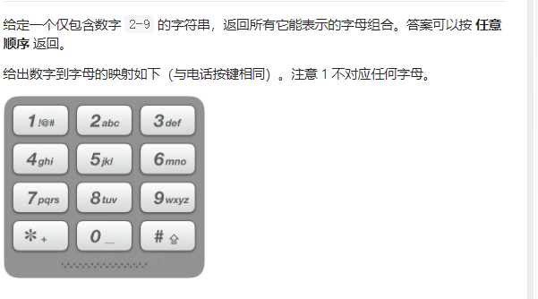

 回溯算法 

## 17 电话号码的字母组合

!

[题解](https://leetcode-cn.com/problems/letter-combinations-of-a-phone-number/solution/dian-hua-hao-ma-de-zi-mu-zu-he-by-leetcode-solutio/)

```java
  public List<String> letterCombinations(String digits) {
        List<String> list = new ArrayList();
        if(digits.length()==0) return  list;
        String strs[] = {"abc","def","ghi","jkl","mno","pqrs","tuv","wxyz"};
        StringBuilder str = new StringBuilder();
        dfs(strs,list,str,digits,0);
        return list;
    }
    void dfs(String strs[],List<String> list,StringBuilder s,String digits,int depth){
      if(depth==digits.length()){
         list.add(s.toString());
         return;
      }
      String temp = strs[digits.charAt(depth)-'0'-2];
      for(int i=0;i<temp.length();i++){
        dfs(strs,list,s.append(temp.charAt(i)),digits,depth+1);
        s.deleteCharAt(s.length()-1);
      }
    }
```

## 22 括号生成

递归

[题解](https://leetcode-cn.com/problems/generate-parentheses/solution/hui-su-suan-fa-by-liweiwei1419/)

```java
public List<String> generateParenthesis(int n) {
       List<String> list = new ArrayList();
       dfs(list,"",0,0,n);
       return list;

    }
    void dfs(List<String> list, String s, int left , int right,int n){
      if(left==n&&right==n) {
        list.add(s);
        return;
      }
      if(left<right) return;
      if(left>n||right>n) return;
      dfs(list,s+"(",left+1,right,n);
      dfs(list,s+")",left,right+1,n);
     
    }
```


## 39. 组合总和

#### 回溯算法 + 剪枝

1. 结束条件 

    1.1  target<0  结束，结果集不保存

    1.2   target=0 刚好合适，将结果集保存在里面

2.  递归步骤  

    2.1  循环遍历数组  如果当前数组的值 大于目标值 无法分配 直接返回 

   2.2 更新target 更新begin ，list加入结果 继续递归

    2.3  递归完成 list删除刚刚加入的结果    减枝 

剪枝提速  将数组进行排序  也就是步骤2.1

[题解](https://leetcode-cn.com/problems/combination-sum/solution/hui-su-suan-fa-jian-zhi-python-dai-ma-java-dai-m-2/)

```java
 public List<List<Integer>> combinationSum(int[] candidates, int target) {
        List<List<Integer>> res = new ArrayList<>();
        LinkedList<Integer> list = new LinkedList();
        Arrays.sort(candidates);
        dfs(candidates, 0, target, list, res);
        return res;
    }

    /**
     * @param candidates  数组
     * @param begin   开始的位置，也就是下次遍历的开始位置
     * @param target  目标值
     * @param list    当前的结果
     * @param res  最终结果
     */
    private void dfs(int[] candidates, int begin, int target, LinkedList<Integer> list, List<List<Integer>> res) {
        // target 为负数和 0 的时候不再产生新的孩子结点
        if (target < 0) {
            return;
        }
        if (target == 0) {
            res.add(new ArrayList<>(list));
            return;
        }
        // 重点理解这里从 begin 开始搜索的语意
        for (int i = begin; i < candidates.length; i++) {
            if(target-candidates[i]<0) break;
            list.addLast(candidates[i]);
            // 注意：由于每一个元素可以重复使用，下一轮搜索的起点依然是 i，这里非常容易弄错
            dfs(candidates, i, target - candidates[i], list, res);
            // 状态重置
            list.removeLast();
        }
    }
```

## 40. 组合总和 II

这道题的思路和组合总和的思路一样，但是也有区别

上一道题39题的思路是选取的数字在下一层递归的时候可以再次被选取

这道题的要点是上一次被选取的、数字这一次不能被选取，同时在同一层递归的数字中 不能有相同的数字 。因此这道题要比上一道题多一次减枝。

难点在于如何去重，


解释语句: if cur > begin and candidates[cur-1] == candidates[cur] 是如何避免重复的。摘抄来自[leetcode](https://leetcode-cn.com/problems/combination-sum-ii/solution/hui-su-suan-fa-jian-zhi-python-dai-ma-java-dai-m-3/225211)

```
这个避免重复当思想是在是太重要了。
这个方法最重要的作用是，可以让同一层级，不出现相同的元素。即
                  1
                 / \
                2   2  这种情况不会发生 但是却允许了不同层级之间的重复即：
               /     \
              5       5
                例2
                  1
                 /
                2      这种情况确是允许的
               /
              2  
                
为何会有这种神奇的效果呢？
首先 cur-1 == cur 是用于判定当前元素是否和之前元素相同的语句。这个语句就能砍掉例1。
可是问题来了，如果把所有当前与之前一个元素相同的都砍掉，那么例二的情况也会消失。 
因为当第二个2出现的时候，他就和前一个2相同了。
                
那么如何保留例2呢？
那么就用cur > begin 来避免这种情况，你发现例1中的两个2是处在同一个层级上的，
例2的两个2是处在不同层级上的。
在一个for循环中，所有被遍历到的数都是属于一个层级的。我们要让一个层级中，
必须出现且只出现一个2，那么就放过第一个出现重复的2，但不放过后面出现的2。
第一个出现的2的特点就是 cur == begin. 第二个出现的2 特点是cur > begin.
```

代码：

```java
public List<List<Integer>> combinationSum2(int[] candidates, int target) {
        List<List<Integer>> res = new ArrayList<>();
        LinkedList<Integer> list = new LinkedList();
        Arrays.sort(candidates);
        dfs(candidates, 0, target, list, res);
        return res;
    }
        private void dfs(int[] candidates, int begin, int target, LinkedList<Integer> list, List<List<Integer>> res) {
        // target 为负数和 0 的时候不再产生新的孩子结点
        if (target < 0) {
            return;
        }
        if (target == 0) {
            res.add(new ArrayList<>(list));
            return;
        }
        // 重点理解这里从 begin 开始搜索的语意
        for (int i = begin; i < candidates.length; i++) {
             //大减枝  
            if(target-candidates[i]<0) break;
            //小减枝 
            if(i>begin&&candidates[i]==candidates[i-1]) continue;
            list.addLast(candidates[i]);
            dfs(candidates, i+1, target - candidates[i], list, res);
            // 状态重置
            list.removeLast();
        }
    }
```


## 46. 全排列

这道题的思路就是回溯 ，和组合总和的思路一样，就是把每一个数字都要遍历到，但是遍历的顺序不一样。每个数字的使用次数也只能为1 。

组合总和用来保存遍历状态的方法是使用了排序和下标的操作，有点像零钱兑换，下标的不断增加，这样之前的就遍历过，之后的就没被遍历。而全排列不许要被排序，一个数访问了，它之前的数可能还没有被访问。因此可以使用一个状态数组 Boolean dp[] 来保存，也可以使用一个Set来保存已经遍历过的数字，方法也是一样，不过速度要慢很多。

```java
 public List<List<Integer>> permute(int[] nums) {
         List<List<Integer>> res = new ArrayList();
         LinkedList<Integer> list = new LinkedList();
         boolean bo[]= new boolean[nums.length+1];
        dfs(nums,list,res,bo);
        return res; 
    }
    void dfs(int nums[],LinkedList<Integer> list,List<List<Integer>> res, boolean bo[]){
        if(list.size()==nums.length){
            res.add(new LinkedList(list));
            return ;
        }
        for(int i=0;i<nums.length;i++){
            if(bo[i]==true) continue;
            bo[i]=true;
            list.offer(nums[i]);
            dfs(nums,list,res,bo);
            list.removeLast();
            bo[i]=false;
        }
    }
```


## 47. 全排列 II

 这道题日和46题全排列的区别在于  46题的数组中没有重复的元素，全排列的结果中没有重复值，这道题的数组中有重复值，如果按照46题的方法来做 肯定 会有重复的值。

这道题的难点在于 如何对结果进行去重复。

1. ###### 方法一  使用set去重，set可以对list集合去重 但是效率jid

2. ###### 方法二  使用排序比较的方法。 

   ```
   if(i>0&&nums[i]==nums[i-1]&&bo[i-1]==false) continue;
   ```

   这句话 代表的意思是  在在当前的循环内，如果a和b挨着的，且a=b  那么如果访问 a  ，接着访问b是没有问题的。如果访问b，先判断a是否被访问过，如果a没有被访问，那么结果和先访问a的结果是一样的，直接continueb、 剪纸，如果a访问过了，说明顺序是对的，直接访问。这样就可以保证结果是相同的 。 

   这道题  的去重方法可以和组合总和2 的排序方法进行一个比较。加深印象

代码

```java
    public List<List<Integer>> permuteUnique(int[] nums) {
        List<List<Integer>> res = new ArrayList<>();
        LinkedList<Integer> list = new LinkedList();
        Arrays.sort(nums);
        boolean bo[]=new boolean[nums.length];
        dfs(nums,list, res,bo);
        return res;
    }
    private void dfs(int[] nums,LinkedList<Integer> list, List<List<Integer>> res,boolean bo[]) {
        if (list.size()==nums.length) {
            res.add(new ArrayList<>(list));
            return;
        }
        // 重点理解这里从 begin 开始搜索的语意
        for (int i = 0; i < nums.length; i++) {
            if(bo[i]==true) continue;
            if(i>0&&nums[i]==nums[i-1]&&bo[i-1]==false) continue;
            bo[i]=true;
            list.offer(nums[i]);
            dfs(nums,list,res,bo);
            list.removeLast();
            bo[i]=false;;
        }
    }
```


## 78. 子集

这道题太太太具有代表性了！！！！！

### 解法一 ：DFS 金典算法

代码：

```java
 class Solution {
   public List<List<Integer>> subsets(int[] nums) {
        List<List<Integer>>  res = new ArrayList<>();
        dfs(0,res,new ArrayList<Integer>(),nums);
         res.add(new ArrayList<>());
        return res;

    }
    public void  dfs(int index,List<List<Integer>> res,List<Integer> list,int nums[]){
   //  System.out.println(index);
      for(int j =index;j<nums.length;j++){
      list.add(nums[j]);
      res.add(new ArrayList(list));
      dfs(j+1,res,list,nums);
      list.remove(list.size()-1);
      }

    }
 }
```

### 解法二 位运算！！

解题思路
第二次接触到通过二进制枚举子集，上一道题是1178，也是枚举子集
这次主要是把这道题的这种解法梳理一下，当然还有递归等常规解法。就不记录了。

首先这道题求解的是整数数组的所有子集，由于元素互不相同，也就是求每个所有数的一个组合，长度在0-nums.length,
包括[],不难得结果的大小应该为

1. 枚举2^nums.length种结果
举例说明:
nums=[1,2,3]
枚举所有二进制位，有
0=[000],1=[001],2=[010],3=[011],4=[100],5=[101],6=[110],7=[111]
每个二进制代表是否取当前位置的数，其中0代表不取当前位置的值，1代表取当前位置的值。
二进制位怎么枚举呢，其实就通过for循环，从[000]到[111]，即i从0到2^nums.length-1
2. 遍历每一个子集，接下来就是如何取当前子集位置为1的数，所有子集的结果就是答案
  用一个循环，j的值从0-nums.length-1，判断当前位置是否是1，是1就加到当前子集的结果集里。
  方法：这里使用了位运算，将当前子集向右移，每次移动j位，然后判断最后一位是否是1（与1相与，是1 结果是1，最后一位是0 结果是0）是1就讲当前位置的值加入结果。
  比如:101，十进制为5,
  j=0,5>>0=101 最后一位为 1，结果加上当前位置nums[0]=1,结果集[1]
  j=1,5>>1=010,最后一位为0，结果不加上当前位置
  j=2,5>>2==001,最后一位为1 ，结果加上当我位置，nums[2]=3,结果集[1,3]
  将[1,3]加入最终结果集。

```java
class Solution {
    public List<List<Integer>> subsets(int[] nums) {
      List<List<Integer>> res = new ArrayList();
            for(int i=0;i<(1<<nums.length);i++){
                List<Integer> list = new ArrayList<>();
                for(int j =0;j<nums.length;j++){
                    if(((i>>j)&1)==1) list.add(nums[j]);
                }
                res.add(list);
            }
            return  res;
    }
    }

```


### 解法三

遍历数组，每次遍历都将结果集遍历一遍，并把结果集加上当前遍历的数，在加入到结果集，是新创建的。

```java
 List<List<Integer>> res = new ArrayList();
        res.add(new ArrayList<>());
        for(int a : nums){
            List<List<Integer>> list = new ArrayList<>();
            for(List<Integer> list1:res){
                ArrayList<Integer> newarraylist = new ArrayList<>(list1);
                newarraylist.add(a);
                list.add(newarraylist);
            }
            res.addAll(list);
        }
        return res;

```

python更简洁：

```python
class Solution:
    def subsets(self, nums: List[int]) -> List[List[int]]:
      res = [[]]
      for i in nums:
        res= res+[j+[i] for j in res]
      return res
```


## 90.子集 II

这道题跟足额和总和二几乎一模一样

```
 public List<List<Integer>> subsetsWithDup(int[] nums) {
        List<List<Integer>> res= new ArrayList();
        LinkedList<Integer> list = new LinkedList();
        Arrays.sort(nums);
        dfs(nums,0,res,list);
        return res;
    }
    void dfs(int []nums,int left,List<List<Integer>> res,LinkedList<Integer> list){
           if(list.size()<=nums.length) {
               res.add(new ArrayList(list));
           }else return;
           for(int i=left;i<nums.length;i++){
               if(i>left&&nums[i]==nums[i-1]) continue;
                list.add(nums[i]);
                dfs(nums,i+1,res,list);
                list.removeLast();
           }
    }
```

## 842 将数组拆分成斐波那契序列

写得太恶心了  ，速度太慢，过几天再来从新写一次

```java
  List<Integer> res;
    public List<Integer> splitIntoFibonacci(String S) {
        res = new LinkedList<>();
        LinkedList list = new LinkedList();
        dfs(S,S.length()-1,list);
        Collections.reverse(res);
        return res;
    }
    void dfs(String s,int index,LinkedList<Integer> list){
        if(res.size()!=0) return;
        if(index<0) {
            if(isFb(list)) res=new ArrayList<>(list);
            return;
        }
        for(int i=index;i>=0;i--){
            if(list.size()>=3&&!isFb(list)) {
                return;
            }
            String  str= s.substring(i,index+1);
            if(str.length()>1&&str.charAt(0)=='0') continue;
           long a=Long.valueOf(str);
            if(a>Integer.MAX_VALUE) break;
            list.offer((int)a);
            //剪纸
            dfs(s,i-1,list);
            list.removeLast();
        }
    }
    boolean isFb(LinkedList<Integer> list){
        if(list.size()<3) return false;
        Integer pre =list.getLast();
        Integer next=list.get(list.size()-2);
        for(int i=list.size()-3;i>=0;i--){
            if(pre+next!=list.get(i)) return false;
            pre=next;
            next=list.get(i);
        }
        return true;
    }
```

改了一下，超过了百分之50 还是慢

```java
 List<Integer> res;
    public List<Integer> splitIntoFibonacci(String S) {
        res = new LinkedList<>();
        LinkedList list = new LinkedList();
        dfs(S,0,list);
       // Collections.reverse(res);
        return res;
    }
    void dfs(String s,int index,LinkedList<Integer> list){
          if(index==s.length()) {
              if(list.size()>=3)
              res=new ArrayList<>(list);
              return;
          }

        for(int i=index;i<s.length();i++){
            String  str= s.substring(index,i+1);
            if(str.length()>1&&str.charAt(0)=='0') continue;

            long a=Long.valueOf(str);
            if(a>Integer.MAX_VALUE) break;
            int num= (int)a;

            if(list.size()>=2) {
                Integer nums1 = list.getLast();
                Integer nums2 = list.get(list.size() - 2);
                if (num > nums1 +nums2) break;
                else if (num < nums1 + nums2) continue;
            }
            list.offer(num);
            dfs(s,i+1,list);
            list.removeLast();
        }
        }
```

