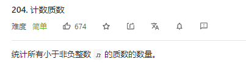

## 已解决题目列表

数学问题：

求约数：

1.求约数个数

对于一个大于1正整数n可以[分解质因数](https://baike.baidu.com/item/分解质因数)：


则n的[正约数](https://baike.baidu.com/item/正约数/882466)的个数就是


。

其中a1、a2、a3…ak是p1、p2、p3，…pk的指数。

2.求所有的约数

## 三角形面积求法

已知三个顶点坐标

1 已知:ΔABC三个顶点坐标A(x1,y1),B(x2,y2),C(x3,y3).求它的面积S
第1步:求以其中一个顶点为始点的两个向量
例:向量AB=(x2-x1,y2-y1),向量AC=(x3-x1,y3-y1)
第2步:用公式求面积
例:S=(1/2)|(x2-x1)(y3-y1)-(x3-x1)(y2-y1)|

1、已知三角形底a，高h，则 S=ah/2。

2、设三角形三边分别为a、b、c，内切圆半径为r

则三角形面积=(a+b+c)r/2。

3、设三角形三边分别为a、b、c，外接圆半径为R

则三角形面积=abc/4R。

4、已知三角形三边a,b,c，则

（海伦公式）（p=(a+b+c)/2）

S=sqrt[p(p-a)(p-b)(p-c)]

=sqrt[(1/16)(a+b+c)(a+b-c)(a+c-b)(b+c-a)]

=1/4sqrt[(a+b+c)(a+b-c)(a+c-b)(b+c-a)]


**即某一自然数的约数个数是它各质因数的次数分别加1相乘的积！！！**

## 求组合数

[组合数和杨辉三角](https://blog.csdn.net/bell041030/article/details/88911180)

```
 public static  long C(int a, int b){
        long res = 1;
        for(int i = a, j = 1; j <= b; i --, j ++){
            res = res * i / j;
            // 大于n已无意义，且防止爆Long
        }
        return res;
    }		
```


## 最大公约数

```java
//辗转相除法
    public int GCD(int x,int y){
        int a = Math.min(x,y);
        int b = Math.max(x,y);
        while (b%a!=0){
            int c = b%a;
            b = a;
            a = c;
        }
        return  a;
    }
  //更相减损术
    public int GCD2(int x,int y){
        int a = Math.min(x,y);
        int b = Math.max(x,y);
        int temp =1;
        while (a%2==0&&b%2==0){
            a=a/2;
            b=b/2;
            temp*=2;
        }
        while (a!=b){
            int c = b-a;
            if(c>a){
                b =c;
            }else{
                b=a;
                a=c;
            }
        }
        return  a*temp;
    }
```

## 最小公倍数、

```java
    /**
     * 最小公倍数 =  x*y /  最大公约数
     * @param x
     * @param y
     * @return
     */
 public int LCM(int x ,int y){
        return  x*y/GCD(x,y);
 }

另外，利用gcd，还可以求出两个整数a和b的最小公倍数lcm(a,b)，只要用这两个数的乘积除以最大公约数即可。即 gcd(a,b)*lcm(a,b)=a*b 。
int lcm(int a, int b){ return a/gcd(a,b) * b};
 注意公式的写法：如果把lcm写成 a*b/gcd(a,b)，可能会得到错误的答案——a*b可能会溢出！使用上述写法，只要保证最终结果在int范围之内，这个函数就不会出错。
```

## 判断质数  1 不是质数

```java
//判断质数
public  boolean judge(int num){
 for(int i=2;i<=Math.sqrt(num);i++){
     if(num%i==0) return  false;
 }
 return  true;
}
```

## 分解质因数

```java
//分解质因数 https://www.cnblogs.com/youxin/p/3232049.html
List<Integer> getPrime(int num){
  List<Integer> list = new ArrayList<>();
  for(int i=2;i<=num;i++){
      while (i!=num){
          if(num%i!=0){
              break;
          }
          list.add(i);
          num=num/i;
      }
  }
  list.add(num);
  return  list;
}
```

## 进制转换：

##### n>n 万能方法:

```
    BigInteger bigint=new BigInteger(hexs, 16);//hexs  :String 类型数据
    int numb=bigint.toString(hexs));
```

##### 10->n 万能 

```
Integer.toString(num,hexs); 
```

##### N->10 万能

```
Integer.parseInt("1001",2)
```

##### n->2   

```
1.取余法

2.使用移位操作

3.Integer.toBinaryString(n);
```

##### 10->8

```
Integer.toOctalString(int i)   //返回i的八进制的字符串表示
```

##### 10>16

```
Integer.toHexString(i)
```


##### 16->2 

```
map
```


##### 16->8

```
1. 16->2 and 2->10
2. 16->10 and 10->2 
```


## 7. 整数反转

这道题有个要求 就是不能用long型去存储

思路就是每次循环 都判断是否越界  以及 下次是否 越界 排除法

```java
  public int reverse(int x) {
       int res = 0;
       while(x!=0){
         int temp = x%10;
         if(res>Integer.MAX_VALUE/10||(res*10==Integer.MAX_VALUE&&temp>7)){
           return 0;
         }
         if(res<Integer.MIN_VALUE/10||(res*10==Integer.MIN_VALUE&&temp<-8)){
          return 0;
         }
         x=x/10;
         res=res*10+temp;
       }  
    
    return res;
    }
```


## 50. Pow(x, n)

这道题需要注意的地方是有个测试用例为**-2147483648**，如果将他转为正数的话，会丢失精度，int 的取值范围为 -2^31至2^31-1 (-2147483648 ~ 2147483647)，因此必须用一个long来保存N，才不会丢失。背住这道题。

### 方法一：快速幂

```java

double quickMul(double x, long long N) {
        double ans = 1.0;
        // 贡献的初始值为 x
        double x_contribute = x;
        // 在对 N 进行二进制拆分的同时计算答案
        while (N > 0) {
            if (N % 2 == 1) {
                // 如果 N 二进制表示的最低位为 1，那么需要计入贡献
                ans *= x_contribute;
            }
            // 将贡献不断地平方
            x_contribute *= x_contribute;
            // 舍弃 N 二进制表示的最低位，这样我们每次只要判断最低位即可
            N /= 2;
        }
        return ans;
    }

    double myPow(double x, int n) {
        long long N = n;
        return N >= 0 ? quickMul(x, N) : 1.0 / quickMul(x, -N);
    }


```

### 方法2： 调用库函数，

### pow是一个本地方法 

```java
    public double myPow(double x, int n) {
           long a=n;
          return a>=0?Math.pow(x,a):(1.0/Math.pow(x,-a));
    }
```

## 204 计数质数



### 

### 解法一  暴力 超时

### 解法二 埃氏筛

```Java 
class Solution {
    public int countPrimes(int n) {
     if(n<2) return 0; 
     int count  =0;
     boolean  b[]= new boolean[n+1];
     for(int i=2;i<n;i++){
         if(!b[i]){ 
            count ++;
            int j=i;
            while(j<n){
                b[j] =true;
                j=j+i;
            }
        }
     }   
     return count;
    }

}
```

