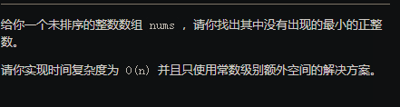
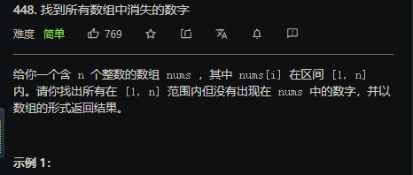

## 1.两数之和

### 解法一 暴力

### 解法二 hash

```java
public int[] twoSum(int[] nums, int target) {
         Map<Integer ,Integer> map = new HashMap();
         for(int i = 0 ;i < nums.length ; i++){
               if(map.containsKey(target-nums[i])) 
                  return new int[]{map.get(target-nums[i]),i};
               else  map.put(nums[i],i);
         }
         return new int[2];
    }
```

## 41 缺失的第一个正数



原地hash算法

```java
class Solution {
    public int firstMissingPositive(int[] nums) {
        for(int i=0;i<nums.length;i++){
            while(nums[i]!=i+1&&nums[i]<nums.length&&nums[i]>0&&nums[i]!=nums[nums[i]-1]){
                int temp = nums[i];
                nums[i] = nums[temp-1];
                
                nums[temp-1] = temp;
            }
        }
        for(int i=0;i<nums.length;i++){
            if(nums[i]!=i+1) return i+1;
        }
        return nums.length+1;
    }
}
```

### 448 原地hash 找到所有数组中消失的数字




## 442 数组中的重复

## 数据  


## 217. 存在重复元素

### 方法一 set

用set去重复比较快，之前用map存储 然后遍历 ，速度特别差

```java
 public boolean containsDuplicate(int[] nums) {
       HashSet<Integer> set = new HashSet();
        for(int i:nums){
           if(set.add(i)==false) return true;
        }
        return false;
    }
```

### 方法二 排序

这个方法居然要比上面那个方法快一些们， 想不通为什么，可能是因为要计算hash值？  后面再来讨论。

```java
public boolean containsDuplicate(int[] nums) {
       Arrays.sort(nums);
        int n = nums.length;
        for (int i = 0; i < n - 1; i++) {
            if (nums[i] == nums[i + 1]) {
                return true;
            }
        }
        return false;
    }
```

## 49 .字母异位词分组

典型的hash题目，解法很多，以后再来做一遍

```java
public List<List<String>> groupAnagrams(String[] strs) {
        List<List<String>> list = new ArrayList<>();
        Map<String,List<String>>  map= new HashMap<>();
        for(String s:strs){
            char chs[] = s.toCharArray();
            Arrays.sort(chs);
            String s1= String.valueOf(chs);
            if(map.containsKey(s1)) map.get(s1).add(s);
            else {
                List<String> newlist = new ArrayList<>(); 
                newlist.add(s);
                map.put(s1,newlist);
             }
    }
         for(List<String> l : map.values()){
             list.add(l);
         }
         return list;
}
```

## 290  单词规律


```java
  public boolean wordPattern(String pattern, String s) {
        Map<Character,String> map  =  new HashMap();
        String strs[] = s.split(" ");
        if(strs.length!=pattern.length()) return false;
        for(int i=0;i<pattern.length();i++){
           Character c = pattern.charAt(i);
           String   str = strs[i];
           if(map.containsKey(c)){
               if(!map.get(c).equals(str)) return false;
           }else {
               if(map.containsValue(str)) return false;
               map.put(c,str);
           }
        }
        return true;

    }
```

## 387. 字符串中的第一个唯一字符

> 给定一个字符串，找到它的第一个不重复的字符，并返回它的索引。如果不存在，则返回 -1。

这道题没什么好说的

遇见统计 就hash

```java
 public int firstUniqChar(String s) {
       char ch[] =s.toCharArray();
       int hash[] = new int[26];
     //  int pre=ch.length-1;
       for(int i=ch.length-1;i>=0;i--){
          hash[ch[i]-'a']++;
       }
      for(int i=0;i<=ch.length-1;i++){
          if(hash[ch[i]-'a']==1) return  i; 
      }
      return -1;
    }
```

[]()

## 