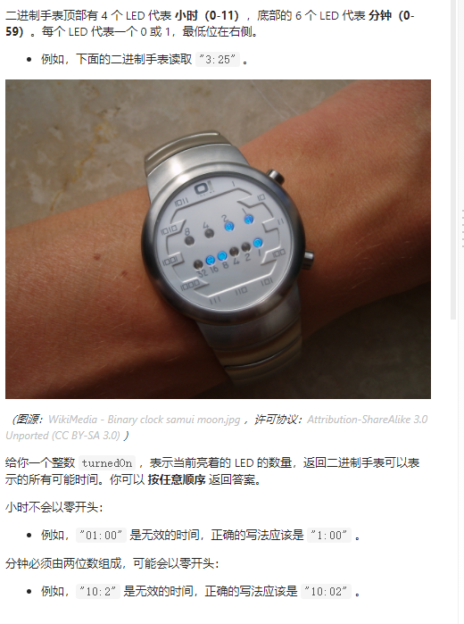
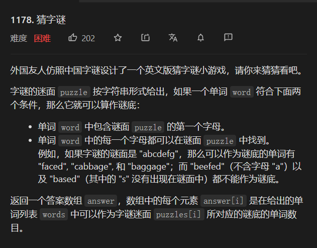
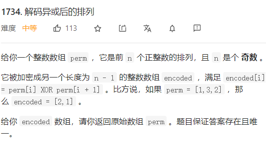

## 位运算技巧 

1.求最后一个二进制位  x = n&(-n)

2.去掉最后一个二进制位  x=  n&(n-1)

## 389 找不同

### 解法一： hash

```java
 public char findTheDifference(String s, String t) {
   int len=s.length();
   int  hash1[]=new int[26];
   int hash2[]= new int[26];
   for(int  i =0;i<len;i++){
     hash1[s.charAt(i)-'a']++;
     hash2[t.charAt(i)-'a']++;
   }
    hash2[t.charAt(len)-'a']++;
    for(int i=0;i<26;i++){
        if(hash1[i]!=hash2[i]) return (char)(i+'a');
    }
    return 'a';
    }
```

### 解法二 位运算

使用异或运算可以解题主要因为异或运算有以下几个特点：

* 一个数和0做XOR运算等于本身：a⊕0 = a
* 一个数和其本身做XOR运算等于 0：a⊕a = 0
* XOR 运算满足交换律和结合律：a⊕b⊕a = (a⊕a)⊕b = 0⊕b = b


[题解](https://leetcode-cn.com/problems/find-the-difference/solution/hua-jie-suan-fa-389-zhao-bu-tong-by-guanpengchn/)

```java
 public char findTheDifference(String s, String t) {
      char  res= t.charAt(t.length()-1);
      for(int i=0;i<s.length();i++){
            res^=s.charAt(i);
            res^=t.charAt(i);
      }
      return res;
    }
```

## 403 二进制手表



思路是枚举二进制 巧妙！！！

```java
class Solution {
    public List<String> readBinaryWatch(int turnedOn) {
    List<String>  res = new ArrayList();
    for(int i=0;i<12;i++){
         if(Integer.bitCount(i)>turnedOn) continue;
           for(int j=0;j<60;j++){
               if(Integer.bitCount(i)+Integer.bitCount(j)==turnedOn){
                   res.add(""+i+":"+(j<=9?("0"+j):j));
               }
           }
    }
    return res;
    }
}
```


## 1178 猜字谜




这道题要和第78 题 子集 结合起来，属于一道金典的综合题目

[官方题解](https://leetcode-cn.com/problems/number-of-valid-words-for-each-puzzle/solution/cai-zi-mi-by-leetcode-solution-345u/)

思路 :

*  使用状态压缩，记录word中的每一哥单词

* 遍历puzzle 美枚举puzzle[i]中的每一个子集，判断word中是否有字符串和我相等
* 统计最终的数目，并且相加，


### 解法一  子集+状态压缩

 

```JAVA
class Solution {
    public List<Integer> findNumOfValidWords(String[] words, String[] puzzles) {
      HashMap<Integer, Integer> map = new HashMap<>();
        for (String s : words) {
            int count = 0;
            for (int i = 0; i < s.length(); i++) {
                count |= 1 << (s.charAt(i) - 'a');
            }
            map.put(count, map.getOrDefault(count, 0) + 1);
        }
        List<Integer> res = new ArrayList<>();
        for (String s : puzzles) {
           
            List<Integer> list = subsets(s.substring(1,s.length()));
           // System.out.println(list);
            int count=0;
            for(int i=0;i<list.size();i++){
              int first = 1 << (s.charAt(0) - 'a');
              first|=list.get(i);
              count+=map.getOrDefault(first,0);
            }
            res.add(count);
            //枚举子集
        }
        return res;
    }
   public List<Integer> subsets(String s) {
        List<Integer> res = new ArrayList();
        int len = s.length();
        for(int i  =0 ;i<(1<<len);i++){
          int num = 0;
          for(int j  = 0;j<len;j++){
            if(((i>>j)&1)==1)  {
            num|=1<<(s.charAt(j)-'a');
            }
           
          }
           res.add(num);
        }
        return res;
    }
 

}
```

## 1734  解码异或后的序列



### 解法 找规律 

```java
class Solution {
    public int[] decode(int[] encoded) {
 int res[] = new  int[encoded.length+1];
         int a =0;
         for(int i=1;i<encoded.length;i+=2){
             a=a^encoded[i];
         }
         for(int i=1;i<=encoded.length+1;i++) a=a^i;
         res[0] =a;
         for(int i=1;i<res.length;i++){
             res[i]=res[i-1]^encoded[i-1];
         }
         return  res;
    }
}
```

