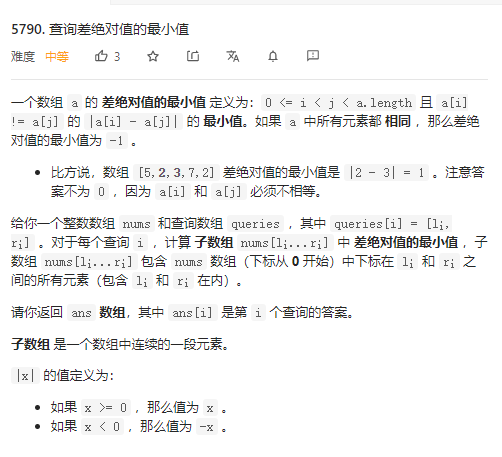

## 5790 查询差绝对值的最小值



**解题思路：桶排序 +前缀和** 

```java
class Solution {
    public int[] minDifference(int[] nums, int[][] queries) {
        int len = nums.length;
        int pre[][] = new int[len+1][101];
        for(int i=0;i<len;i++){
            for(int j=0;j<=100;j++) pre[i+1][j] = pre[i][j];
            pre[i+1][nums[i]]++;
        }
     
        int res[] = new int[queries.length];
        for(int i=0;i<queries.length;i++){
            int l =  queries[i][0];
            int r =  queries[i][1];
            int min = Integer.MAX_VALUE;
            int last = -1;
            for(int j=1;j<=100;j++){
                if(pre[r+1][j]-pre[l][j]==r-l+1){
                    res[i] =  -1;
                    break;
                }
                else if(pre[r+1][j]-pre[l][j]!=0){
                    if(last==-1)last =  j;
                    else {
                        min =  Math.min(min,j-last);
                        last =  j;
                    }
                }
            }
            if(last!=-1){
                res[i]= min;
            }
        }
return res;
    }
}
```

