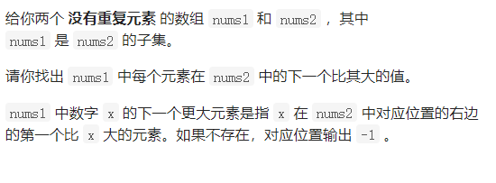
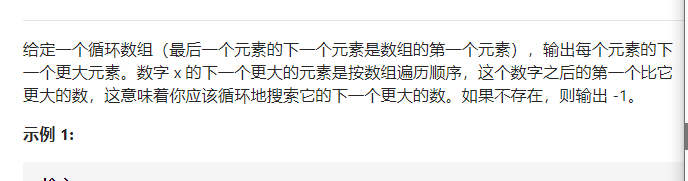
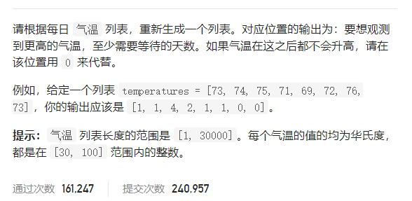
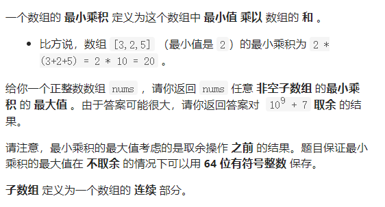

## 496 下一个跟打元素I



单调栈：

```java
class Solution {
    public int[] nextGreaterElement(int[] nums1, int[] nums2) {
 int res[] = new int[nums1.length];
          HashMap<Integer,Integer> map = new HashMap<>();
          Deque<Integer> deque = new LinkedList<>();
          for(int i=0;i<nums2.length;i++){
              while (!deque.isEmpty()&&nums2[deque.peekLast()]<nums2[i]){
                  map.put(nums2[deque.pollLast()],nums2[i]);
              }
              deque.add(i);
          }
        
          for(int i=0;i<nums1.length;i++){
  
              res[i] = map.getOrDefault(nums1[i],-1);
          }
          return  res;
    }
}
```


## 503 下一个更大的元素II



经典单调栈问题

```java
class  {
    public int[] nextGreaterElements(int[] nums) {
//单调栈
  LinkedList<Integer> list = new LinkedList();
  int len= nums.length;
  int res[] = new int[len];
  for(int i=0;i<len+len-1;i++){
     if(list.size()==0){
         list.add(i);
     }else{
         while(list.size()!=0&&nums[list.getLast()]<nums[i%len]){
             res[list.getLast()] =nums[i%len];
             list.removeLast();
         }
         list.addLast(i%len);
     }
  }
  for(int i=0;i<len;i++) if(nums[i]==nums[list.getFirst()]) res[i]=-1;
  //while(list.size()!=0&&list.getFi)
 // for(int a:list) res[a]=-1;
  return res;
    }
}
```

## 739 每日温度



解法 单调栈

```java
class Solution {
      public int[] dailyTemperatures(int[] T) {
 int res[] = new int[T.length];
         Deque<Integer> deque = new LinkedList<>();
        for (int i = 0; i < T.length; i++) {
            while (!deque.isEmpty()&&T[deque.peekLast()]<T[i]){
                res[deque.peekLast()] = i-deque.pollLast(); 
            }
            deque.offerLast(i);
        }
        return  res;
      }
}
```


## 1438 绝对值差不超过限制的最长连续子数组

[题解](https://leetcode-cn.com/problems/longest-continuous-subarray-with-absolute-diff-less-than-or-equal-to-limit/solution/he-gua-de-shu-ju-jie-gou-hua-dong-chuang-v46j/)

[题解二](https://leetcode-cn.com/problems/longest-continuous-subarray-with-absolute-diff-less-than-or-equal-to-limit/solution/jue-dui-chai-bu-chao-guo-xian-zhi-de-zui-5bki/)

### 解法一 TreeMap 碉堡了！

```java
class Solution {
      public int longestSubarray(int[] nums, int limit) {
        TreeMap<Integer,Integer> map = new TreeMap<>((a,b)->b-a);
        int left =0;
       int  res = 0;
        for(int i=0;i<nums.length;i++){
            map.put(nums[i],map.getOrDefault(nums[i],0)+1);
            while (map.firstKey()-map.lastKey()>limit){ 
                map.put(nums[left],map.get(nums[left])-1);
                if(map.get(nums[left])==0) map.remove(nums[left]);
                left++;
            }
            res = Math.max(i-left+1,res);
        }
        return res;
                


    }
}
```


### 解法二  单调栈

```java
class Solution {
    public int longestSubarray(int[] nums, int limit) {
       Deque<Integer> max  = new LinkedList<>();
            Deque<Integer> min =  new LinkedList<>();
            int left = 0;
            int res  = 0 ;
            for(int i =0;i<nums.length;i++){
              while(!max.isEmpty() && nums[max.getLast()]<nums[i]){
                  max.removeLast();
              }
              while(!min.isEmpty() && nums[min.getLast()]>nums[i]){
                    min.removeLast();
              }
              max.offerLast(i);
              min.offerLast(i);
              while (!max.isEmpty() && !min.isEmpty() && nums[max.peek()]-nums[min.peek()] > limit){
                  if(max.peek() <= left) max.poll();
                  if(min.peek() <= left) min.poll();
                  left++;
              }
              res = Math.max(res,i-left+1);
              
            }
            return  res;
    }
}
```


## 1856 子数组最小乘积的最大值



单调栈 解决

解法 **枚举最小值，然后使用两次单调栈，分别寻找左右两边第一个比当前数字小的值。同时还使用了前缀和的思想。**

注意：这里的单调栈比较特殊，因为以前的单调栈一般都是从左到右是由大到小。但是这里的单调栈是从左到右是单调递增的。

一般的单调栈都是寻找第一个比他大的数字的下标，而这里的思路是遇到比当前数大的，就出栈，直到遇到比当前树小的。

很有意思！！！记住

```
class Solution {
  int mod = 1000000007;
    public int maxSumMinProduct(int[] nums) {
         long  pre[] = new long[nums.length+1];
         for(int i=0;i<nums.length;i++){
             pre[i+1] = pre[i] +  nums[i];
         }
         //求左边的最小值
        //求右边的最小值
         int left[] = new int[nums.length];Arrays.fill(left,-1);
         int right[] = new int[nums.length];Arrays.fill(right,nums.length);
         Deque<Integer> deque = new LinkedList<>();
         for(int i=0;i<nums.length;i++){
             while (!deque.isEmpty()&&nums[deque.peekLast()]>=nums[i]){
                 deque.pollLast();
                 //left[i] = l;
             }
             if(!deque.isEmpty()){
                 left[i] = deque.peekLast();
             }
             deque.offerLast(i);
         }
         deque.clear();
        for(int i=nums.length-1;i>=0;i--){
            while (!deque.isEmpty()&&nums[deque.peekLast()]>=nums[i]){
                deque.pollLast();
                //left[i] = l;
            }
            if(!deque.isEmpty()){
                right[i] = deque.peekLast();
            }
            deque.offerLast(i);
        }
        long max =0;
        for(int i=0;i<nums.length;i++){
            int l =  left[i];
            int r =  right[i];
            long sum = pre[r]-pre[l+1];
            max =Math.max(sum*nums[i],max);
        }
        return  (int)(max%mod);
    }
}
```

