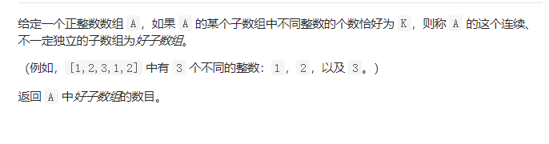

## 11 盛最多水的容器


```java 
 public int maxArea(int[] height) {
      int left = 0;
      int right = height.length-1;
      int max =0;
      while(left<right){
        if(height[left]<height[right]){
          max = Math.max((right-left)*height[left],max);
          left++;
         
        }else{
          max= Math.max((right-left)*height[right],max);
          right--;
        }

      }
      return max;

    }
```


## 15. 三数之和

##### 解法：排序加双指针

1. 对数组排序

2. 遍历数组
   -  以每一个下标作为第一个节点，用双指针遍历节点后面的元素。
   -  如果  nums[i]>0 说明当前节点以及后面的节点都不能满足要求
   -  如果当前节点和前面一个节点相同，跳过当前接节点，因为题目要求结果不能相同
      -  nums[i]+nums[L]+nums[R]==nums[i]+nums[L]+nums[R]，加入结果。判断左界和右界是否和下一位置重复，将指针移动到不重复的位置。
      -  如果和大于0，右指针左移
      -  如果和小于0，左指针右移

```java
public List<List<Integer>> threeSum(int[] nums) {
 List<List<Integer>> res= new ArrayList<>();
           Arrays.sort(nums);
           for(int i=0;i<nums.length;i++){
                int j=i+1,k=nums.length-1;
                if(nums[i]>0) break;
                if(i>=1&&nums[i]==nums[i-1]) continue;
                while(j<k){
                    if(nums[i]+nums[j]+nums[k]==0){
                        List<Integer> list = new ArrayList<>();
                        list.add(nums[i]);
                        list.add(nums[j]);
                        list.add(nums[k]);
                        res.add(list);
                        while(j<k&&nums[j+1]==nums[j])j++;
                        while(j<k&&nums[k]==nums[k-1]) k--;
                        j++;
                        k--;
                    }
                    else if(nums[j]+nums[k]+nums[i]>0)k--;
                    else if(nums[i]+nums[j]+nums[k]<0) j++;
                }  
           }
           return res;
    }
```

## 16 最接近的三数之和

阶梯思路跟上一道题一样

```java
    public int threeSumClosest(int[] nums, int target) {
      int res = 1000000;
      Arrays.sort(nums);
      for(int i =0;i<nums.length;i++){
        int left =i+1;
        int right =nums.length-1;
        while(left<right){
        int sum = nums[i]+nums[left]+nums[right];
        if(Math.abs(sum-target)<Math.abs(res-target)) res = sum;
        if(sum<target) left++;
        else if(sum>target) right--;
        else if(sum==target) return sum;
        }
      }
      return res;
    }
```


## 611.有效三角形的个数

### 解法一  暴力  

```Java
int res=0;
    public int triangleNumber(int[] nums) {
      Arrays.sort(nums);
      for(int i=0;i<nums.length-2;i++){
         
          for(int j=i+1;j<nums.length-1;j++){
            
              for(int k=j+1;k<nums.length;k++){
                 
                  if(valid(nums[i],nums[j],nums[k])) res++;
                  else break;
              }
          }
      }
   return res;
    }
    boolean valid(int a, int b, int c) {
        if (a + b > c && a + c > b && b + c > a) {
            return true;
        } else {
            return false;
        }
    }
```


### 解法二 双指针

```java
 public int triangleNumber(int[] nums) {
        Arrays.sort(nums);
        int result = 0;
        for (int i = nums.length - 1; i >= 2; i--) {
            int k = 0;
            int j = i - 1;
            while (k < j) {
                //满足该条件，说明从num[k]到num[j]的数都满足要求，结果直接加上j - k
                if (nums[k] + nums[j] > nums[i]) {
                    result += j - k;
                    j--;
                } else {
                    //否则k自增，重新判断
                    k++;
                }
            }
        }
        return result;
    }
```

### 解法三 二分查找‘

```java
int res=0;
    public int triangleNumber(int[] nums) {
      Arrays.sort(nums);
      for(int i=0;i<nums.length-2;i++){
         
          for(int j=i+1;j<nums.length-1;j++){
             int left= find(nums,j+1,nums[i]+nums[j]); 
             if(left!=-1) res=res+left-j-1;
             else res+=nums.length-j-1;
          }
      }
   return res;
    }
    boolean valid(int a, int b, int c) {
        if (a + b > c && a + c > b && b + c > a) {
            return true;
        } else {
            return false;
        }
    }
    int find(int nums[],int left,int target){
        int right = nums.length-1;
        while (left < right){
            int mid = left + ( right - left ) / 2;
            if (nums[mid] < target) left = mid + 1;
            else right = mid;
        }
        return nums[left]<target?-1:left;
    }
```

## 713. 乘积小于K的子数组


题解 [](https://leetcode-cn.com/problems/subarray-product-less-than-k/solution/cheng-ji-xiao-yu-kde-zi-shu-zu-by-leetcode/)

这道题把  主要是求区间个数  有一个很精辟的地方 就是求区间个数 的方法  


这道题跟992题类比一下  有搞头。

我觉得这道题 可以改为 . **和小于K的子数组**

```java 
//找规律把 这道题
    public int numSubarrayProductLessThanK(int[] nums, int k) {
  
       int left=0;
       int right=0;
       int len = nums.length;
       int count =1;
       int res =0;
       while(right<len){
         count*=nums[right];
         while(left<=right&&count>=k){
          count/=nums[left];
          left++;
         }
        res+=right-left+1;
        right++;
       }
       return res;
    }
```


## 992. K 个不同整数的子数组



双指针 噩梦开始

题解 看这里 

[题解](https://leetcode-cn.com/problems/subarrays-with-k-different-integers/solution/k-ge-bu-tong-zheng-shu-de-zi-shu-zu-by-l-ud34/)

```java
    public int subarraysWithKDistinct(int[] A, int K) {
     return kmax(A,K)-kmax(A,K-1);
    }
    int kmax(int A[],int K){
            int left =0;
      int right=0;
      int count =0;
      int len = A.length;
      int  res=0;
      int hash[] = new int[A.length+1];
      while(right<len){  
          hash[A[right]]++;
          if(hash[A[right]]==1) count++;
          while(count>K){
            hash[A[left]]--;
            if(hash[A[left]]==0){
             count--;
            }
            left++;
          }
          res+=right-left+1;
          right++;
      }
      return res;

    }
```

