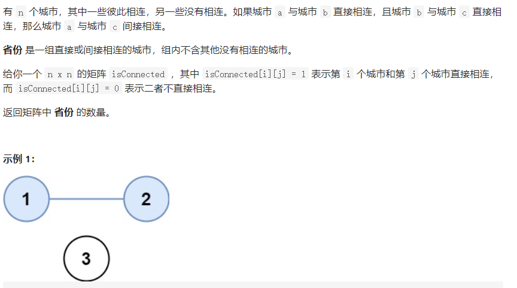
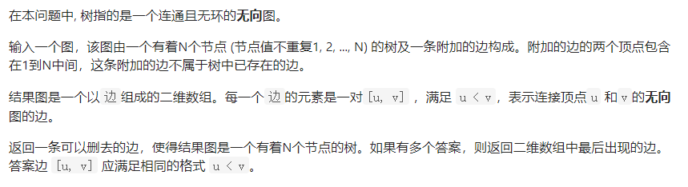
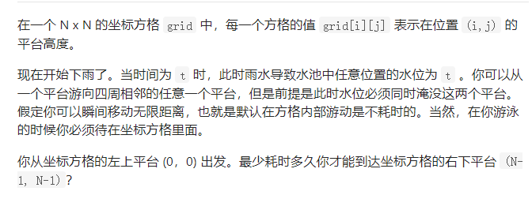
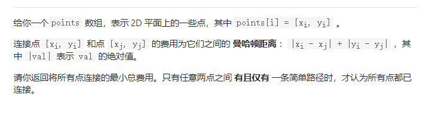
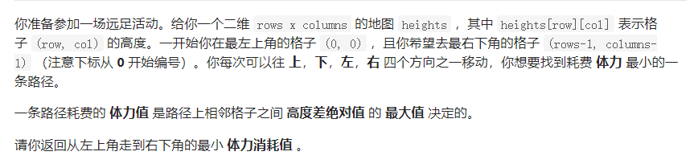
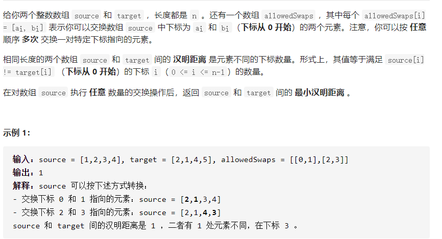
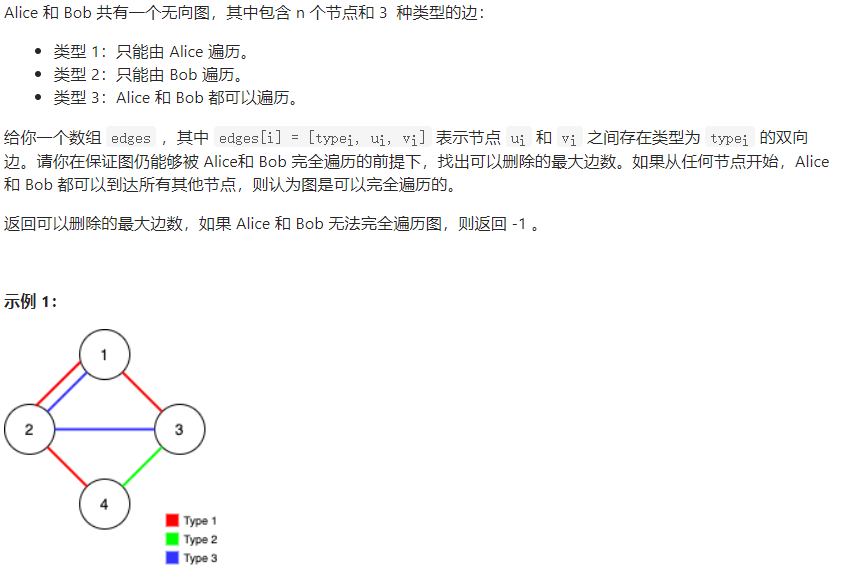

并查集

## 399 除法求值

[题解](https://leetcode-cn.com/problems/evaluate-division/solution/399-chu-fa-qiu-zhi-nan-du-zhong-deng-286-w45d/)


这道题有点难   思路有并查集  floyd 和dfs算法  其他两种没有搞懂 ，后面再来看。

这道题的解法并查集。

难点在于如何保存边的值 ，解法汇总使用了一个wight数组，用来保存该节点到其父节点的值。

难点在于：

* 构建无向图 及其含义
* 如何更新边的值 在路径压缩的同时要维护权值的变化
* 如何计算 不通联通分支合并的试试权值的计算

```java
 public double[] calcEquation(List<List<String>> equations, double[] values, List<List<String>> queries) {
      HashMap<String,Integer> map = new HashMap();
      //取出所有的字符串
      int id = 0;
      for(List<String> list :  equations){
        String a = list.get(0);
        String b = list.get(1);
        if(!map.containsKey(a)){
          map.put(a,id++);
        }
        if(!map.containsKey(b)){
          map.put(b,id++);
        }
      }
      Union u =  new Union(id);
      for(int i = 0;i< equations.size();i++){
        int a = map.get(equations.get(i).get(0));
        int b = map.get(equations.get(i).get(1));
        u.merge(a,b,values[i]);
      }
      double res[] =  new double[queries.size()];
      for(int i = 0;i< queries.size();i++){
        String a = queries.get(i).get(0);
        String b = queries.get(i).get(1);
        if(!map.containsKey(a)||!map.containsKey(b)){
          res[i] = -1.0;
          continue;
        }
        res[i] = u.get(map.get(a),map.get(b));
      }
      return res;

      
      //Union u  = new Union()
    }
}
class Union{
  int parent[];
  int count;
  double weight[];
  public Union(int len){
     this.parent= new int[len];
     this.count=len;
     this.weight= new double[len];
     for(int i=0;i<len;i++){
       parent[i] = i;
       weight[i]=1.0;
     }
  }
  public double connect(int x,int y){
     return 1.0;
  }

  public double get(int x,int y){
      int fx = find(x);
      int fy = find(y);
      if(fx ==  fy){
        return weight[x]/weight[y];
      }
      return -1.0;
  }

  public void merge(int x,int y ,double val ){
      int fx =  find(x);
      int fy = find(y);
      if(fx==fy) return;
      parent[fx] = fy;
      weight[fx] = weight[y]*val/weight[x];
  }
  public int  find(int x){
     if(x != parent[x]){
       int pre = parent[x];
       parent[x] = find(parent[x]);
       weight[x] = weight[x] * weight[pre];
     }
     return  parent[x];
  }
```


## 547 省份数量



### 解法一  并查集

并查集没什么好说的，就是寻找无向连通图有多少个联通分支。

* 将路径不断加入，如果两个的祖先不一样 就加入  如歌祖先一样 就不管
* 返回最终的联通分支数量，是一道典型的模板题目

```java
class Union{
    int  count;
    int  hash[];
    public  Union(int count){
        this.count=count;
        hash = new int[count];
        for(int i=0;i<count;i++){
            hash[i]=i;
        }
    }
    public void combine(Integer a ,Integer b){
           int  ha = find(a);
           int hb = find(b);
           if(ha!=hb){
                hash[ha]=hb;
                count--;
          }
    }
    public int find(Integer  x){
        while(hash[x]!=x){
            x=hash[x];
        }
        return x;
    }
}
class Solution {
    public int findCircleNum(int[][] isConnected) {
        Union u = new Union(isConnected.length);
      for(int i=0;i<isConnected.length;i++){
          //u.add(i);
           //System.out.println(u.map);
          for(int j=i+1;j<isConnected[i].length;j++){
             if(isConnected[i][j]==1){
                u.combine(i,j);
             }
          }
      }
      return u.count;
    }
}
```

### 解法二  dfs


```java

class Solution {
    public int findCircleNum(int[][] isConnected) {
      boolean visted[]= new boolean[isConnected.length];
      int count  = 0;
      for(int i=0;i<visted.length;i++){
          //维护一个访问数组，遍历这个访问数组，如果没有访问，就加一，然后访问与这个点相连的所有点，不断递归的访问完全。
          if(!visted[i]){
              dfs(i,isConnected,visted);
               count++;
          }
      }
      return count;
    }
    
    //这个递归没有返回和结束条件，访问完 也就结束
    public  void  dfs(int i,int  isConnected[][],boolean visted[]){
        visted[i]=true;
        for(int j=0;j<isConnected[i].length;j++){
            if(isConnected[i][j]==1&&!visted[j]){
                dfs(j,isConnected,visted);
            }
        }
    }
}
```

### 解法三  BFS


```java 
class Solution {
    public int findCircleNum(int[][] isConnected) {
      boolean visted[]= new boolean[isConnected.length];
      int count  = 0;
      for(int i=0;i<visted.length;i++){
          //和dfs同样的原理，使用队列来进行BFS   直到队列里面没有任何的节点 即 与当前节点相连的所有节点都被遍历完全。
          if(!visted[i]){
              Queue<Integer> queue = new LinkedList<>();
              queue.offer(i);
              while(!queue.isEmpty()){
                  Integer  a  = queue.poll();
                  visted[a]=true;
                  for(int j=0;j<visted.length;j++){
                      if(isConnected[a][j]==1&&!visted[j]){
                          queue.offer(j);
                      }
                  }
              }
              //dfs(i,isConnected,visted);
              count++;
          }
      }
      return count;
    }
    public  void  dfs(int i,int  isConnected[][],boolean visted[]){
        visted[i]=true;
        for(int j=0;j<isConnected[i].length;j++){
            if(isConnected[i][j]==1&&!visted[j]){
                dfs(j,isConnected,visted);
            }
        }
    }
}
```


## 684 冗余连接



并查集的金典题目

思路就是 不断的将边加入到并查集里，当这条边在联通分支里面 加入后，联通分支由树变为了含有回路的图，证明这一条边是想想要的结果。

直接使用并查集的模板

## 778  水位上升的游泳池中游泳



### 解法一并查集

这道题和1631 最小体力消耗路径 的思路一样

不过这道题是把每一条边的权值设为两个端点高度的最大值。

```java
class Solution {
    public int swimInWater(int[][] grid) {
        int len = grid.length*grid[0].length;
        int m=grid.length;
        int n = grid[0].length;
          ArrayList<Edge> list = new ArrayList<>();
        for(int i=0;i<grid.length;i++){
          for(int j= 0;j<grid[i].length;j++){
               int num = i*grid[i].length+j;
               if(i<m-1)
               //添加下面坐标
               list.add(new Edge(Math.max(grid[i][j],grid[i+1][j]),num,num+n));
               if(j<n-1)
               //添加右边坐标
               list.add(new Edge(Math.max(grid[i][j],grid[i][j+1]),num,num+1));
          }
        }
        Unino u = new Unino(m*n);
        list.sort((a,b)->a.price-b.price);
        for(Edge e :list){
            u.merge(e.ed[0],e.ed[1]);
            if(u.connected(0,m*n-1)) return e.price;
          }
          return 0;
        
    }
}
class Edge{
    int price;
    int ed[];
    public Edge(int price,int x,int y ){
        this.price=price;
        this.ed= new int[]{x, y};
    }
}
class Unino{
    int parent[];
    int rank[];
    int count;
    public Unino(int len){
    this.count=len;
    parent = new int[len+1];
    rank=new int[len+1];
    for(int i = 1; i <= len; i ++){
        parent[i] = i;
     }
    }
    int  find(int  x){
       return parent[x] == x ? x : (parent[x] = find(parent[x]));
    }
    void  merge(int a ,int b){
        int x = find(a);
        int y = find(b);
        if(x!=y){
            if(x<y){
              int temp = x;
              x=y;
              y=temp;
            }
          parent[y]=x;
          if(parent[x]==parent[y]) rank[x]+=1;
        }
    }
    boolean connected(int x ,int y) {
      int  a =find(x);
      int b=find(y);
      return a==b;
    }
    
}
```


### 解法二 二分查找

s思路不多说  [官方题解](https://leetcode-cn.com/problems/swim-in-rising-water/solution/shui-wei-shang-sheng-de-yong-chi-zhong-y-862o/)

```java
  class Solution {
      public int swimInWater(int[][] grid) {
          int len = grid.length*grid[0].length;
          int m=grid.length;
          int n = grid[0].length;
          int left=0;
          int right=2500;
          int ri[][] = new int[][]{{-1,0}, {1,0}, {0,1}, {0,-1}};
          while(left<right){
            int mid = left + (right - left) / 2;
            Queue<Integer> qu = new LinkedList<>();
            qu.offer(0);
            boolean vis[] = new boolean[m*n];
            while(!qu.isEmpty()){
                int  a = qu.poll();
                int x = a / n;
                int y = a % n;
                for(int i = 0; i < 4; i ++){
                  int nx = x + ri[i][0];
                  int ny = y + ri[i][1];
                  if(nx >= 0 && ny >= 0 && nx < m &&  ny < n && !vis[nx * n +ny] && Math.max(grid[x][y],grid[nx][ny])<=mid ){
                      qu.offer(nx * n + ny);
                      vis[nx * n + ny] = true;
                  }
                }

            }
            if(vis[m*n - 1]){
              right = mid ;
            }else {
              left =mid + 1;
            }
          }
          return left ; 
          
      }
  }
```

## 959 由斜杠划分区域


这道题就是把区域抽象为图中的节点


[题解](https://leetcode-cn.com/problems/regions-cut-by-slashes/solution/you-xie-gang-hua-fen-qu-yu-by-leetcode-67xb/)

```java
class Solution {
       public int regionsBySlashes(String[] grid) {
        int len  = grid.length;
        int count =  4*len*len;
        Union u = new Union(count);
        //遍历每个方格
        for(int i = 0 ;i < len; i++){
            char ch[] =  grid[i].toCharArray();
            int k = 0;
            for(int j = 0; j < len ; j++){
                //计算ch的下标
                int index = i*len*4 + j*4;//计算每个小方格的下标
                if(ch[k] == ' '){
                    u.merge(index,index+1);
                    u.merge(index+1,index+2);
                    u.merge(index+2,index+3);
                    u.merge(index+3,index);
                }else if(ch[k] == '/'){
                   u.merge(index,index+1);
                   u.merge(index+2,index+3);
                }else if(ch[k] == '\\'){
                    u.merge(index+1,index+2);
                    u.merge(index+3,index);
                }
                if(i!=len-1){
                    u.merge(index+3,index+len*4+1);
                }
                if(j!=len-1){
                    u.merge(index+2,index+4);
                }
                k++;
            }
        }
    return u.count;
          }
}
class Union{
    int parent[];
    int count;
    int rank[];
    public  Union(int len){
        parent = new int[len];
        for(int i = 0; i < parent.length; i++){
            parent[i] = i;
        }
        count  = len;
        rank = new int[len];
    }

    public  void merge(int x,int y){
        int fx = find(x);
        int fy = find(y);
        if(fx != fy) {
           if(rank[fx]>rank[fy]){
             int temp = fx;
             fx = fy;
             fy = temp;
           }
            count--;
        }
        if(rank[fx] == rank[fy]) rank[fx]++; 
        parent[fx] = fy;
    }
    public int find(int x){
        return x == parent[x]?x : (parent[x] = find(parent[x]));
    }

}
```


## 990  等式方程的可满足性质

思路其实就是判断不应该在一个联通分支里面的数 是否在联通分支里，如果在就返false

[题解](https://leetcode-cn.com/problems/satisfiability-of-equality-equations/solution/deng-shi-fang-cheng-de-ke-man-zu-xing-by-leetcode-/)

```java
class Solution {
    public boolean equationsPossible(String[] equations) {
        Union u = new Union();
        for(String s  : equations){
          char a =  s.charAt(0);
          char b = s.charAt(3);
          char c  = s.charAt(1);
          if(c=='=') u.merge(a-'a',b-'a');
        }
        for(String s  : equations){
          char a =  s.charAt(0);
          char b = s.charAt(3);
          char c  = s.charAt(1);
          if(c=='!') {
            if(u.connect(a-'a',b-'a')){
              return false;
            }
          }
        }
        return true;

    }
}
class Union{
  int parent[];
  public Union(){
  parent =  new int[26];
  for(int i = 0; i < parent.length; i++){
    parent[i] = i;
  }
  }
  public void merge(int x, int y){
      int mx = find(x);
      int my  = find(y);
      if(mx == my) return ;
     // System.out.println(mx+" "+ my);
      parent[mx] = my; 
  }
  public boolean connect(int x , int  y){
   // System.out.println(find(x)+" "+find(y));
    return find(x)==find(y);
  }
  public int  find(int x){
     return x==parent[x]?x:(parent[x]=find(parent[x]));
  }
   
}
```


## 1202 交换字符串中的元素

[题解](https://leetcode-cn.com/problems/smallest-string-with-swaps/solution/1202-jiao-huan-zi-fu-chuan-zhong-de-yuan-wgab/)

这道题的思路和第1722题差不多  都是遍历一个联通分支里面的数。基本上需要使用ahshmap去存储  。

```java
public String smallestStringWithSwaps(String s, List<List<Integer>> pairs) {
        HashMap<Integer,PriorityQueue<Character>> map = new HashMap();
        Union u = new Union(s.length());
        boolean visit[] = new boolean[s.length()];
        for(int i=0;i<pairs.size();i++){
            int a = pairs.get(i).get(0);
            int b = pairs.get(i).get(1);
            u.merge(a,b);
        }
        char ch[] = s.toCharArray();
        for(int i=0;i<ch.length;i++){
            map.computeIfAbsent(u.find(i),(key)->new PriorityQueue<Character>()).offer(ch[i]);
        }
        StringBuilder str = new StringBuilder();
        for(int i = 0;i <  s.length();i++){
          str.append(map.get(u.find(i)).poll());
        }
        return str.toString();
    }
}
class Union{
  int parent[];
  int rank[];
  public Union(int len){
    parent=new int[len];
    for(int i=0;i<parent.length;i++){
      parent[i] = i;
    }
    rank= new int[len];
  }
  public boolean isconnected(int x,int y){
 return find(x)==find(y);
  }
  public void merge(int x ,int y){
    int fx = find(x);
    int fy =find(y);
    if(fx != fy){
       if(rank[fx]>rank[fy]){
         int temp = fx;
         fx=fy;
         fy=temp;
       }
    }  
    if(rank[fx]==rank[y]) rank[fy]++;
    parent[fx] = fy; 
  }
  public int find(int x){
    return x==parent[x]?x:(parent[x]=find(parent[x]));
  }
```

## 1584 连接所有节点的最小费用



kruskal [算法](https://leetcode-cn.com/problems/min-cost-to-connect-all-points/solution/lian-jie-suo-you-dian-de-zui-xiao-fei-yo-kcx7/)

```java
class Solution {
    public int minCostConnectPoints(int[][] points) {
      Union  u = new Union(points.length);
        PriorityQueue<int []> que = new  PriorityQueue<>(((o1, o2) -> o1[0]-o2[0]));
        for(int i  = 0 ;i<points.length;i++){
            for(int j = i+1;j<points.length;j++){
                int a[] = points[i];
                int b[] = points[j];
                int len = Math.abs(a[0] - b[0]) + Math.abs(a[1] - b[1]);
                que.offer(new int[]{len,i,j});                   
            }
        }
        int res  = 0;
        while(!que.isEmpty()){
           int a[] = que.poll();
           if(u.isconnect(a[1],a[2])) continue;
           u.merge(a[1],a[2]);
           res +=  a[0];
           if(u.count==1) return  res; 
        }
        return  res;
    }
}
class Union{
    int parent[];
    int count;
    int rank[];
    public  Union(int len){
        parent = new int[len];
        for(int i = 0; i < parent.length; i++){
            parent[i] = i;
        }
        count  = len;
        rank = new int[len];
    }
    public  boolean isconnect(int x ,int y ){
        return  find(x) == find(y);
    }
    public  void merge(int x,int y){
        int fx = find(x);
        int fy = find(y);
        if(fx != fy) {
           if(rank[fx]>rank[fy]){
             int temp = fx;
             fx = fy;
             fy = temp;
           }
            count--;
        }
        if(rank[fx] == rank[fy]) rank[fx]++; 
        parent[fx] = fy;
    }
    public int find(int x){
        return x == parent[x]?x : (parent[x] = find(parent[x]));
    }

}
```


## 1631 最小体力消耗路径



### 解法一 并查集

并查集的思路就是吧整个格子抽象为一张图，去掉所有的边，然后不断的往里面加边，直到联通，最后加的边就是结果，

[题解](https://leetcode-cn.com/problems/path-with-minimum-effort/solution/duo-tu-xiang-xi-fen-xi-jie-ti-si-lu-fen-7z89x/)

```java
class Solution {
    public int minimumEffortPath(int[][] heights) {
        int len = heights.length*heights[0].length;
        int m=heights.length;
        int n = heights[0].length;
        ArrayList<int[]> list = new ArrayList<>();
        for(int i=0;i<heights.length;i++){
          for(int j= 0;j<heights[i].length;j++){
               int num = i*heights[i].length+j;
               if(i<m-1)
               //添加下面坐标
               list.add(new int[]{Math.abs(heights[i][j]-heights[i+1][j]),num,num+n});
               if(j<n-1)
               //添加邮编坐标
               list.add(new int[]{Math.abs(heights[i][j]-heights[i][j+1]),num,num+1});
          }
        }
        Unino u = new Unino(m*n);
        list.sort((a,b)->a[0]-b[0]);
        for(int  e[] :list){
            u.merge(e[1],e[2]);
            if(u.connected(0,m*n-1)) return e[0];
          }
          return 0;
        
    }
}
class Unino{
    int parent[];
    int rank[];
    int count;
    public Unino(int len){
    this.count=len;
    parent = new int[len+1];
    rank=new int[len+1];
    for(int i=1;i<=len;i++){
        parent[i]=i;
     }
    }
    int  find(int  x){
       return parent[x]==x?x:(parent[x]=find(parent[x]));
    }
    void  merge(int a ,int b){
        int x = find(a);
        int y = find(b);
        if(x!=y){
            if(x<y){
              int temp = x;
              x=y;
              y=temp;
            }
          parent[y]=x;
          if(parent[x]==parent[y]) rank[x]+=1;
        }
    }
    boolean connected(int x ,int y) {
      int  a =find(x);
      int b=find(y);
      return a==b;
    }
    
}
```


### 解法二 二分查找+BFS

因为题目的意思是寻找左上在、到左下的最小体力消耗值，也就是寻找一条能够使左上角和左下角相邻路线，其中所有路线中格子之间最大高度差的最小值。可以使用二分法，然后进行BFS遍历。

遍历条件 

* 如果下一节点与当前节点的差值小于mid 则加入 。这就是为什么!vis[nx*n+ny] 加上这句话的原因。因为被访问过，说明有路径到达这个点，就不需要访问了。

  


```java
class Solution {
    public int minimumEffortPath(int[][] heights) {
      //二分查找
      int   m = heights.length;
      int n = heights[0].length;
      int left =0;
      int right = 1000000;
      int fx[][]= new int[][]{{0,1},{0,-1},{-1,0},{1,0}};
      while(left<right){
          int mid  = left+(right-left)/2;
          Queue<Integer> que = new LinkedList();
          que.offer(0);
          boolean vis[] = new boolean[m*n];
          vis[0]=true;
          while(que.size()!=0){
            int  a  = que.poll();
            int  x = a/n;
            int y = a%n;
            for(int i=0;i<4;i++){
              int  nx = x+fx[i][0];
              int ny = y+fx[i][1];
              if(nx>=0&&ny>=0&&nx<m&&ny<n&&!vis[nx*n+ny]&&Math.abs(heights[nx][ny]-heights[x][y])<=mid){
                  que.offer(nx*n+ny);
                  vis[nx*n+ny]=true;
              }
            }
          }
          if(vis[m*n-1]){
            right=mid;
          }else{
            left=mid+1;
          }
      }
      return left;


    }
    
}
```

### 解法3 BFS+DP

这个思想吧 其实就是甩一个Dp数组记录从起点到当前前点路径差的最小体力消耗。注意核心代码

```java
class Solution {
    public int minimumEffortPath(int[][] heights) {
        //BFS+DP
        int m = heights.length;
        int n = heights[0].length;
        int fx[][] = new int[][]{{0, 1}, {0, -1}, {-1, 0}, {1, 0}};
        Queue<Integer> que = new LinkedList();
        int dp[][] = new int[m][n];
        for (int i = 0; i < m; i++) {
            for (int j = 0; j < n; j++) {
                dp[i][j] = Integer.MAX_VALUE;
            }
        }
        dp[0][0]=0;
        que.offer(0);
        while (que.size() != 0) {
            int a = que.poll();
            int x = a / n;
            int y = a % n;
            for (int i = 0; i < 4; i++) {
                int nx = x + fx[i][0];
                int ny = y + fx[i][1];
                if (nx >= 0 && ny >= 0 && nx < m && ny < n) {
                    //核心代码部分  最小值和最大值是如何取的
                    int c = Math.max(dp[x][y],Math.abs(heights[nx][ny] - heights[x][y]));
                    if (dp[nx][ny] > c) {
                        dp[nx][ny] = c;
                        que.offer(nx * n + ny);
                    }
                }
            }
        }
        return dp[m - 1][n - 1];
    }
}
```

## 1319 联通网络的操作次数

其实就是联通网络  使之成为简单图。就是树 没有回路的图

[题解](https://leetcode-cn.com/problems/number-of-operations-to-make-network-connected/solution/lian-tong-wang-luo-de-cao-zuo-ci-shu-by-leetcode-s/)

```java
class Solution {
    public int makeConnected(int n, int[][] connections) {
        Union u =  new Union(n);
        int res=0;
        for(int con[]:connections){
          if(! u.add(con[0],con[1])){
            res++;
          }
        }
        int count = u.count;
        int len = connections.length;
        if(count-1<=res) return count-1;
        return -1; 
    }
}
class Union{
  int parent[];
  int count ;
  public Union(int n){
    parent = new int[n+1];
    this.count=n;
    for(int i=1;i<=n;i++){
      parent[i]=i;
    }
  }
  public boolean add(int x ,int y){
       int a = find(x);
       int b =find(y);
       if(a==b) return false;
       parent[a]=b;
       count--;
       return true;
  }
  public int find(int x){
    //关键一步状态压缩  ！！！！！
    return parent[x]==x?x:(parent[x]=find(parent[x]));
  }
}
```


## 1722. 执行交换操作后的最小汉明距离




并查集

小技巧  在同一个联通分支里面的元素位置可以随便交换

方法 ：利用可以交换的数组  确定联通分支

遍历soure和targret  将同一个联通分支里面的所有的数据以及出现的次数保存下来。

然后遍历说有的联通分支，比较联通分支里面值不同的数目 ，返回结果。

* 如何保存  保存联通分支的根节点

* 使用map保存次数

* 遍历第二个数组    取出根节点对应的map 然后在根据map进行比较。

  这道题的难点是如何进行比较结果。

```java
class Solution {
    public int minimumHammingDistance(int[] source, int[] target, int[][] allowedSwaps) {
         int res =0;
         int len = source.length;
         Unino union = new Unino(len);
         for(int i=0;i<allowedSwaps.length;i++){
            union.connect(allowedSwaps[i][0],allowedSwaps[i][1]);
         }
        HashMap<Integer,HashMap<Integer,Integer>> map1 = new HashMap();
        for(int  i=0;i<len;i++){
          int  x = union.find(i);
          HashMap<Integer,Integer> m =  map1.computeIfAbsent(x, a->new HashMap<Integer,Integer>());
          m.put(source[i],m.getOrDefault(source[i],0)+1);
        }
        for(int i=0;i<len;i++){
          int  x  = union.find(i);
          HashMap<Integer,Integer>  m1 = map1.get(x);
          if(!m1.containsKey(target[i])||m1.get(target[i])==0)  res++;
          else  m1.put(target[i],m1.get(target[i])-1);
        }
        return res;     
    }
}
class Unino{
    int hash[];
    public Unino(int len){
    hash = new int[len];
    for(int i=0;i<hash.length;i++){
        hash[i]=i;
     }
    }
    int  find(int  x){
        while(hash[x]!=x){
            x=hash[x];
        }
        return x;
    }
    void connect(int a ,int b){
        int x = find(a);
        int  y = find(b);
        if(x!=y){
            hash[x]=y;
        }
    }
    
}
```

## 1579 保证图的可完全遍历




```java 
class Solution {
    public int maxNumEdgesToRemove(int n, int[][] edges) {
      Union a= new Union(n);
      Union b = new Union(n);
      int res=0;
      //创建公共边
      for(int edge[]:edges){
        if(edge[0]!=3) continue;
        if(a.add(edge[1],edge[2])){
           b.add(edge[1],edge[2]);
        }else{
          res++;
        }
      }
      //分别创建 ab的联通分支
    for(int edge[]:edges){
       if(edge[0]==1){
         if(!a.add(edge[1],edge[2])) res++;
       }else if(edge[0]==2){
         if(!b.add(edge[1],edge[2])) res++;
       }
    }
    if(a.count!=1||b.count!=1) return -1;
    return res;


    }
}
class Union{
  int parent[];
  int count ;
  public Union(int n){
    parent = new int[n+1];
    this.count=n;
    for(int i=1;i<=n;i++){
      parent[i]=i;
    }
  }
  public boolean add(int x ,int y){
       int a = find(x);
       int b =find(y);
       if(a==b) return false;
       parent[a]=b;
       count--;
       return true;
  }
  public int find(int x){
    //关键一步状态压缩  ！！！！！
    return parent[x]==x?x:(parent[x]=find(parent[x]));
  }
}
```

