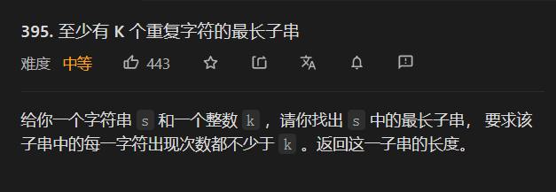
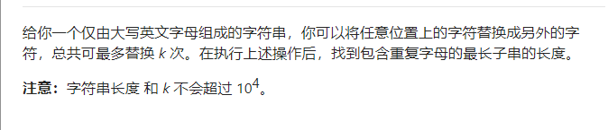
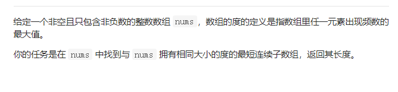
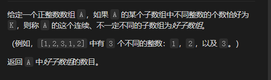
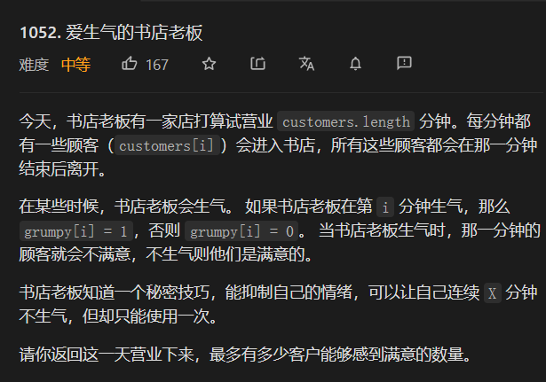

使用滑动窗口，一般需要数据接口来维护这个窗口

比如使用优先队列，使用平衡树

使用优先队列的注意事项：如果问题规模比较小，可以使用remove（）函数，如果问题规模大，使用remove会增加复杂度，导致结果错误。将如何不使用remove函数？

小技巧： 存入数组，new int[]{nums[i],i};

在下次判断的时候，首先判断队列首部元素是否在窗口中，然后不断移除窗口中的元素。

## 3. 无重复字符的最长子串

解法：第一种是暴力，求出所有的子串，然后进行判断

第二种就是使用滑动窗口


```java
 public int lengthOfLongestSubstring(String s) {
         int  a[]= new int[129];
         for(int i = 0; i < 129; i++) {
            a[i] = -1;
        }
         int  start=0;
         int end=0;
         int max=0;
         for(int index=0;index<s.length();index++){
             char c=s.charAt(index);
             start=Math.max(start,a[c]+1);
             a[c]=index;
             max=Math.max(max,index-start+1);
         }
         return max;
    }
```

第二次写题解 没有想到第一种  用的是hash表 来做

思路也是一样的吧

```java
    public int lengthOfLongestSubstring(String s) {
     //   if(s.equals(" ")) return 0 ;
         int a[] = new int[128];
         char ch[] = s.toCharArray();
          Arrays.fill(a,-1);
         int left = 0, right = 0;
         int max = 0;
         for(int i = 0; i < ch.length; i++){
            char c  =  ch[i];
            if(a[c] >= left) {
               left =a[c] + 1;
            }
            a[c] = i;
            max = Math.max(i - left +1, max );
         }
         return max ; 
    }
```


## 209 长度最小子数组

### 解法一 二分查找 （待更新）

### 解法二  滑动窗口

维护一个滑动窗口，窗口的位置不断向后移动，每一次的移动都要更新left的值，让滑动窗口的值在target内，才能进行下一轮循环，

```java
public int minSubArrayLen(int s, int[] nums) {
        int left =0;int right=0;
        int min=nums.length+1;
        int sum=0;
        for(int i=0;i<nums.length;i++){
            sum+=nums[i];
            right=i;
          while(sum>=s){
          //  while(left<=i&&sum-nums[left]>=s){    
              // sum=sum-nums[left];
              // left++;
           // } 
           // if(sum>=s)
          min=Math.min(min,right-left+1);
          sum-=nums[left++];
          }
        }
     return  min==nums.length+1?0:min;
    }
```

## 239 滑动窗口的最大值

[官方的思路最好](https://leetcode-cn.com/problems/sliding-window-maximum/solution/hua-dong-chuang-kou-zui-da-zhi-by-leetco-ki6m/)

### 解法一  优先队列

维护一个优先队列，队列根据滑动窗口里面的数值大小来进行存储，同时存储 下标， 以便及时删除没在窗口中的数。

当然这道题首先需要先添加一个窗口中的所有数，然后再开始滑动。没滑动一个数，直接添加进去，然后优先队列就会自动按照由高到低的顺序排列。取出数字的时候 先判断是否在滑动窗口里面，然后再加入结果中，*

```java
class Solution {
   public int[] maxSlidingWindow(int[] nums, int k) {
        PriorityQueue<int[]> queue=new PriorityQueue<>((a,b)->b[0]-a[0]);
        int[] res=new int[nums.length-k+1];
        for(int i=0;i<k;i++){
            queue.offer(new int[]{nums[i],i});
        }
        res[0]=queue.peek()[0];
        int index=1;
        for(int i=k;i<nums.length;i++){
            queue.offer(new int[]{nums[i],i});
            while(queue.peek()[1]<=i-k) queue.poll();
            res[index++]=queue.peek()[0];
        }
        return res;
    }
}
```

### 解法二 双向队列

这道题就是维护一个双向队列，和第一种解法的思路类似，但是这个方法不需要加入队列 然后进行排序，而是在加入之前进行判断，再加入，让队列保持由高到低的排列顺序。

其中队列中存储的是下标，比较的时候也是按照下标的值来进行比较。在加入的时候，比这个当前的数小的数就从队列总删除，然后在进行加入。如果队列为空，就直接加入。

```java
public int[] maxSlidingWindow(int[] nums, int k) {
        LinkedList<Integer> queue = new LinkedList<>();
        int left=0;int right=0;
        int res[]= new int[nums.length-k+1];
        int index=0;
        for(int i=0;i<k;i++){
            while(queue.size()!=0&&nums[queue.getLast()]<nums[i]){
                queue.removeLast();
            }
            queue.offer(i);
        }
        res[index++]=nums[queue.peek()];
        for(int i=k;i<nums.length;i++){
             while(queue.size()!=0&&nums[queue.getLast()]<nums[i]){
                queue.removeLast();
            }
            queue.offer(i);
            while(queue.peek()<=i-k){
                queue.removeFirst();
            }
            res[index++]=nums[queue.peek()];
        }
        return res;
}
```

## 395 至少有K个字符的最长字符串



题解分别是 [官方题解和](https://leetcode-cn.com/problems/longest-substring-with-at-least-k-repeating-characters/solution/zhi-shao-you-kge-zhong-fu-zi-fu-de-zui-c-o6ww/)雪哥[题解](https://leetcode-cn.com/problems/longest-substring-with-at-least-k-repeating-characters/solution/jie-ben-ti-bang-zhu-da-jia-li-jie-di-gui-obla/)

​	

### 解法一  滑动窗口


```java
class Solution {
    public int longestSubstring(String s, int k) { 
      //记录 种类数目  记录每种的次数  
      //这道题的关键是枚举字符种类数目
      int  res  = 0;
       char ch[] = s.toCharArray();
      for(int i  = 1;i <= 26; i ++){
       // if()
        res = Math.max(getMaxlen(ch,i,k),res);
      }
      return res;
    }
    int getMaxlen(char ch[],int count,int k){
      int left  = 0;
      int  type  = 0;
      int max  =0 ;
      HashMap<Character,Integer> map = new HashMap();
      int len = ch.length;
      int match = 0;// 小于k的数量
      for(int i =0;i < len; i ++){
         //如果不包含 种类加一
         if(!map.containsKey(ch[i])){
            type++;
         }
        map.put(ch[i],map.getOrDefault(ch[i],0)+1);
        if(map.get(ch[i])==k) match++;//如果 达到了k  匹配的数量加一
        //如果种类大于了count 则表示左边界需要右移动  直达区间内种类的数目一定 
        while(type>count){
          char c = ch[left];
          map.put(c,map.get(c)-1); 
          //如果 取出的不匹配了 匹配数减一
          if(map.get(c) == k-1){
             match --;
          }
          //如果取出的为 0  了 种类数减一
          if(map.get(c)==0){
            type--;
            map.remove(c);
          }
          left++;
        }
        //如果匹配数为种类数 并且种类数为count  就表示区间内是合法的，如果种类数或者匹配数目 不合法，右指针就需要右移动
        if(match==count&&type==count) max =Math.max(max,i-left+1);
      }
      return max;
    }
}
```


### 解法二递归

```java
class Solution {
    public int longestSubstring(String s, int k) {
 HashMap<Character,Integer> map = new HashMap<>();
        for(int i =0;i<s.length();i++){
            char c = s.charAt(i);
            map.put(c,map.getOrDefault(c,0)+1);
        }

        for(char c : map.keySet()){
            if(map.get(c)<k){\
                int max =0 ;
                for(String ss:s.split(String.valueOf(c))){
                    max =Math.max(max,longestSubstring(ss,k));
                }
                return max;
            }
        }
        return  s.length();

    }
}
```


## 424 替换后的最长重复字符串

这道题很金典，[题解](https://leetcode-cn.com/problems/longest-repeating-character-replacement/solution/fen-xiang-zhen-cang-de-shuang-zhi-zhen-m-fdsk/)




```java 
 public int characterReplacement(String s, int k) {
          char ch[] = s.toCharArray();
          int left = 0;
          int right = 0;
          int total[] = new int[26];
          int max = 0 ;
          for(int i=0 ;i<s.length();i++){
             char  c =  ch[right];
             total[c-'A']++;
             if(total[c-'A']>total[max]){
             max = c-'A';
             }
             if(total[max]+k<right-left+1){
               total[ch[left]-'A']--;
               left++;
             }
              right++;
          }
         
           return right-left;
    }
```

## 480 滑动窗口的中位数

## 解法一 堆


## 解法二 TreeSet


## 607 数组的度



### 解法一 滑动窗口

思路

* 1.寻找数组最大的度
* 2.滑动寻找数组的度为最大度的时候窗口的最小值

```
public int findShortestSubArray(int[] nums) {
      HashMap<Integer,Integer> hash = new HashMap();
      int maxtime = 0;
      for(int a :nums){
        hash.put(a,hash.getOrDefault(a,0)+1);
         maxtime=Math.max(hash.get(a),maxtime);
      }
      int res  = Integer.MAX_VALUE;
      //寻找最大度数组的长度m
       int left  = 0;
       int right  = 0;
       int len = nums.length;
       int max  = 0;
       int maxnum = 0;
       HashMap<Integer,Integer> map = new HashMap();
       while(right<len){
         map.put(nums[right],map.getOrDefault(nums[right],0)+1);
         while(map.get(nums[right])==maxtime){
           res = Math.min(res,right-left+1);
           map.put(nums[left],map.get(nums[left])-1);
           //if(nums[left] == maxnum) max--;
           left++;
         }
         right++;
       }
       return res; 
    }
```

### 解法二

用数组保存起始位置

```java
public int findShortestSubArray(int[] nums) {
      HashMap<Integer,int[]> hash = new HashMap();
      int maxtime = 0;
      int res = Integer.MAX_VALUE;
      int max =0 ;
      int arr[] =  new int[3];
     for(int i=0;i<nums.length;i++){
        arr = hash.get(nums[i]); 
        if(hash.containsKey(nums[i])){
          arr[2] = i;
          arr[0]++;
        }else{
          int a[] = new int[]{1,i,i};
          hash.put(nums[i],a);
          arr =a;
        }
        if(arr[0]>max){
            max = arr[0];
            res = arr[2]-arr[1]+1;
          }else if(arr[0]==max){
            res = Math.min(arr[2]-arr[1]+1,res);
          }
     }
       return res; 
    }
```

## 992 K个不同整数的子数组



题解：

[题解](https://leetcode-cn.com/problems/subarrays-with-k-different-integers/solution/cong-zui-jian-dan-de-wen-ti-yi-bu-bu-tuo-7f4v/)

关键思路 ：

K个不同整数的子数组=最多由K个不同整数的子数组——最多由k-1个不同整数的子数组

```java
class Solution {
    public int subarraysWithKDistinct(int[] A, int K) {
   return kmax(A,K)-kmax(A,K-1);
    }
    int kmax(int A[],int K){
            int left =0;
      int right=0;
      int count =0;
      int len = A.length;
      int  res=0;
      HashMap<Integer,Integer> map = new HashMap();
      while(right<len){  
          map.put(A[right],map.getOrDefault(A[right],0)+1);
          if(map.get(A[right])==1) count++;
          while(count>K){
            map.put(A[left],map.get(A[left])-1);
            if(map.get(A[left])==0){
            count--;
             map.remove(A[left]);
            }
            left++;
          }
          res+=right-left+1;
          right++;
      }
 return res;

    }
}
```

## 1052. 爱生气的书店老板



[题解](https://leetcode-cn.com/problems/grumpy-bookstore-owner/solution/yong-mi-mi-ji-qiao-wan-liu-zhu-zui-duo-d-py41/)

滑动窗口

* 计算一个滑动窗口内的所有值

* 向右滑动 如果为1 加上  左边如果为1 减去他

  ```java
  class Solution {
      public int maxSatisfied(int[] customers, int[] grumpy, int X) {
          int max  =0 ;
          int count  = 0;
          for(int i  = 0; i < grumpy.length;i++){
            if(grumpy[i]==0) count+=customers[i];
          }
         
          for(int i=0;i<X ;i++){
            if(grumpy[i]==1) count+=customers[i];
          }
          max = count;
          for(int i = X;i<grumpy.length;i++){
            count+=grumpy[i]==1?customers[i]:0;
            count-=grumpy[i-X]==1?customers[i-X]:0;
            max = Math.max(max,count);
          }
          return max;
      }
  }
  ```

  

## 1438  绝对差不超过限制的最长连续子数组

妈的 方法一个比一个精辟 只有想不到 没有做不到

### 解法一  优先队列

[解法](https://leetcode-cn.com/problems/longest-continuous-subarray-with-absolute-diff-less-than-or-equal-to-limit/solution/jue-dui-chai-bu-chao-guo-xian-zhi-de-zui-5bki/)

```
class Solution {
    public int longestSubarray(int[] nums, int limit) {
        PriorityQueue<int[]> min = new PriorityQueue<>((o1, o2) -> o1[0] - o2[0]);
        PriorityQueue<int[]> max = new PriorityQueue<>((o1, o2) -> o2[0] - o1[0]);
        int res = 0;
        int left = 0;
        for (int i = 0; i < nums.length; i++) {
            max.offer(new int[]{nums[i], i});
            min.offer(new int[]{nums[i], i});
            while (!max.isEmpty()&&!min.isEmpty()&&Math.abs(max.peek()[0] - min.peek()[0]) > limit) {
                while (max.peek()[1] <= left) max.poll();
                while (min.peek()[1] <= left) min.poll();
               // System.out.println(max);
                left++;
            }
            res = Math.max(i - left + 1, res);
        }
        return res;
      }
    }

```


### 解法二 单调栈

```
class Solution {
    public int longestSubarray(int[] nums, int limit) {
       Deque<Integer> max  = new LinkedList<>();
            Deque<Integer> min =  new LinkedList<>();
            int left = 0;
            int res  = 0 ;
            for(int i =0;i<nums.length;i++){
              while(!max.isEmpty() && nums[max.getLast()]<nums[i]){
                  max.removeLast();
              }
              while(!min.isEmpty() && nums[min.getLast()]>nums[i]){
                    min.removeLast();
              }
              max.offerLast(i);
              min.offerLast(i);
              while (!max.isEmpty() && !min.isEmpty() && nums[max.peek()]-nums[min.peek()] > limit){
                  if(max.peek() <= left) max.poll();
                  if(min.peek() <= left) min.poll();
                  left++;
              }
              res = Math.max(res,i-left+1);
              
            }
            return  res;
    }
}
```


### 解法三  有序集合 Treemap


```
class Solution {
    public int longestSubarray(int[] nums, int limit) {
        TreeMap<Integer, Integer> map = new TreeMap<>();
        int left = 0;
        int res = 0;
        for (int i = 0; i < nums.length; i++) {
            map.put(nums[i], map.getOrDefault(nums[i], 0) + 1);
            while (map.lastKey() - map.firstKey() > limit) {
                map.put(nums[left], map.get(nums[left]) - 1);
                if (map.get(nums[left]) == 0) map.remove(nums[left]);
                left++;
            }
            res = Math.max(res, i - left + 1);
        }
        return  res;
    }
}
```

