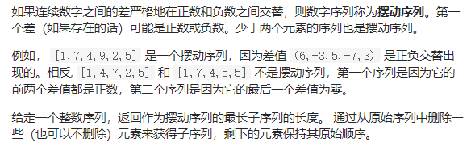
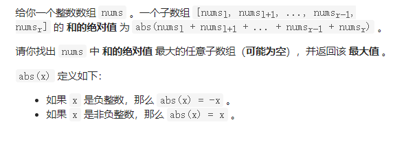

## 区间问题

### 56 合并区间

这道题的思路其实就是排序，然后遍历，挨着挨着遍历

```java
 public int[][] merge(int[][] intervals) {
       List<int[]> list = new ArrayList();
       Arrays.sort(intervals,(a,b)->a[0]-b[0]);
       int []a=intervals[0];
       for(int i=0;i<intervals.length;){
           while(i<intervals.length&&intervals[i][0]<=a[1]){
              a[1]=Math.max(intervals[i][1],a[1]);
              i++;
           }
           list.add(a);
           if(i==intervals.length) break;
           a=intervals[i];
       }
       return list.toArray(new int[list.size()][2]);
    }
```


### 57 插入区间


解题思路：本文的解题方法按照三个步骤

区间加入一共有三种情况，第一种，在interviewing区间的 左边

第二招 和newInterval区间有重叠，重叠的情况包括 右边界等于newInterval左边界， 左边界等于newInterval右边界的情况

第三种情况为区间都在newInterval区间的右边

根据这三种情况，需要进行三次运算，其中第二次运算的逻辑比较重要。直接将newInterval数组改变，可以避免很多的问题。

[题解](https://leetcode-cn.com/problems/insert-interval/solution/bi-xu-miao-dong-li-kou-qu-jian-ti-mu-zhong-die-qu-/)

```java 
 public int[][] insert(int[][] intervals, int[] newInterval) {
        List<int[]> list = new ArrayList<>();
        int index=0;
        while(index<intervals.length&&intervals[index][1]<newInterval[0]){
            list.add(intervals[index]);
            index++;
        }
        while(index<intervals.length&&intervals[index][0]<=newInterval[1]){
            newInterval[1]=Math.max(intervals[index][1],newInterval[1]);
            newInterval[0]=Math.min(intervals[index][0],newInterval[0]); 
            index++;
        }
        list.add(newInterval);
        while(index<intervals.length){
            list.add(intervals[index]);
            index++;
    
        }
        return list.toArray(new int[list.size()][2]);
    }
```

## 摆动序列问题

### 376  摆动序列



#### 解法一 动态规划

、[题解](https://leetcode-cn.com/problems/wiggle-subsequence/solution/tan-xin-si-lu-qing-xi-er-zheng-que-de-ti-jie-by-lg/)

```java
 public int wiggleMaxLength(int[] nums) {
       //int res=nums[0];
       //int dp[] = new int[nums.length];
      // dp[0]=1;
      if(nums.length==0) return 0;
       int high=1;
       int low=1;
       for(int i=1;i<nums.length;i++){
          if(nums[i]>nums[i-1]){
            high=low+1;

          }  else if(nums[i]<nums[i-1]){
            low=high+1;
          } 
       }
        return Math.max(high,low);
    }
```

#### 解法二 贪心

题解 [](https://leetcode-cn.com/problems/wiggle-subsequence/solution/tan-xin-suan-fa-bai-dong-xu-lie-by-jcmla-i31l/)

```java
class Solution {
    public int wiggleMaxLength(int[] nums) {
        if (nums.length==0) return 0;
         if (nums.length==1) return 1;
       
         int pre=nums[1]-nums[0];
         int res=pre==0?1:2;
         for(int i=2;i<nums.length;i++){
             int cur=nums[i]-nums[i-1];
             if(cur>0&&pre<=0||cur<0&&pre>=0){
                 res++;
                 pre=cur;
             }
             //pre=cur;
         }
         return res;

    }

}
```


### 978. 最长湍流子数组

这道题跟摆动序列一样嘛 区别就是这道题要求连续  所以一道题还是要多多思考

所以当出现up或者down的时候，对应的down或者up要恢复到初始状态。

#### 解法一 动态规划

[题解](https://leetcode-cn.com/problems/longest-turbulent-subarray/solution/yi-zhang-dong-tu-xiang-jie-dong-tai-gui-wrwvn/)

```Java
public int maxTurbulenceSize(int[] arr) {
        int up=1;
        
        int down =1;
        int res=1;
        for(int i=1;i<arr.length;i++){
          if(arr[i]>arr[i-1]){
            up=down+1;
            down=1;
          }else if(arr[i]<arr[i-1]){
            down=up+1;
            up=1;
          }
          else{
            down=1;
            up=1;
          }
          res=Math.max(res,Math.max(up,down));
        }
        return res;
```

### 152. 乘积最大子数组

动态规划，这道题和下面这一道题差不多 ，思路一样，都是维护一i个最大值和最小值，

[题解](https://leetcode-cn.com/problems/maximum-product-subarray/solution/cheng-ji-zui-da-zi-shu-zu-by-leetcode-solution/)

```Java
class Solution {
    public int maxProduct(int[] nums) {
         int max= 1;
         int min=1;
         int res=Integer.MIN_VALUE;
         for(int i=0;i<nums.length;i++){   
            int newmax=Math.max(nums[i],max*nums[i]);
            newmax=Math.max(newmax,min*nums[i]);
            int newmin = Math.min(nums[i],min*nums[i]);
            newmin = Math.min(newmin,max*nums[i]);
            max=newmax;
            min=newmin;
            res= Math.max(res,newmax);
         }
     return res;
    }


}
```


### 1749. 任意子数组和的绝对值的最大值



这道题？ 和上面一道题一样，维护一个最大值还有一个最小值，。

这道题就是把问题拆解成两个：

- 求最大连续子序列的值
- 求最小连续子序列的值
- 求上面两个结果的绝对值的最大值

  

```Java
 public int maxAbsoluteSum(int[] nums) {
     int max =0;int min=0;
     int res =0;
     for(int i=0;i<nums.length;i++){
        max = Math.max(max+nums[i],nums[i]);
        min = Math.min(min+nums[i],nums[i]);
        res=Math.max(res,Math.max(max,Math.abs(min)));
     }
     return res;
    }
```

