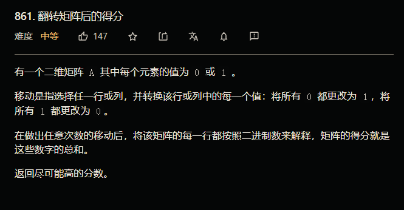

## 861. 翻转矩阵后的得分



思路：

1. 先横竖变换保证第一列全部是1
2. 竖变换保证其他列1比0多

这道题应该算作贪心，

值得注意的地方：

 **不需要真的去翻转矩阵，直接计算最后结果即可** 

```java 
public int matrixScore(int[][] A) {
         for(int i=0;i<A.length;i++){
             if(A[i][0]==0){
                  for(int j=0;j<A[i].length;j++){
                    A[i][j]=A[i][j]==0?1:0;
             }
           }
         }
         int res=0;
         for(int i=0;i<A[0].length;i++){
               int num0=0,num1=0;
               for(int j=0;j<A.length;j++){
                   if(A[j][i]==1) num1++;
                   else num0++;
               }
               res=res+(num0>num1?num0:num1)*(1<<(A[0].length-i-1));

         }
         return res;
    } 
```

