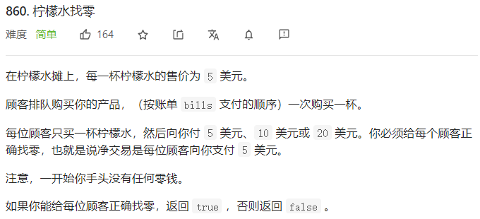

## 738 单调递增的数字

这道题跟数学计算有关，数学思维吧，贪心算法，其实就是从大到小的搜索，如果小于后面的数字就继续搜索，如果大于后面的数字，就将当前的数字减去一，然后把当前数字后面的数字全部变为9 .这就是是一种解法，如果遇到连续相同的数字，只需要记录第一位数字就可以了。

甜姨写得很好 [题解](https://leetcode-cn.com/problems/monotone-increasing-digits/solution/jian-dan-tan-xin-shou-ba-shou-jiao-xue-k-a0mp/)

```java
public int monotoneIncreasingDigits(int N) {
          String s  = String.valueOf(N);
          char a[] = s.toCharArray();
          int max=0;
          int maxindex=0;
          for(int i=0;i<s.length()-1;i++){
               if(max<a[i]-'0'){
                   max=a[i]-'0';
                   maxindex=i;
               }
               if(a[i]>a[i+1]){
                   a[maxindex]=(char)(a[maxindex]-1);
                   for(int j=maxindex+1;j<a.length;j++){
                       a[j]='9';
               }
          }
          }
          return Integer.valueOf(String.valueOf(a));
    }
```


## 861. 翻转矩阵后的得分


思路：

1. 先横竖变换保证第一列全部是1
2. 竖变换保证其他列1比0多

这道题应该算作贪心，

值得注意的地方：

 **不需要真的去翻转矩阵，直接计算最后结果即可** 

```java 
public int matrixScore(int[][] A) {
         for(int i=0;i<A.length;i++){
             if(A[i][0]==0){
                  for(int j=0;j<A[i].length;j++){
                    A[i][j]=A[i][j]==0?1:0;
             }
           }
         }
         int res=0;
         for(int i=0;i<A[0].length;i++){
               int num0=0,num1=0;
               for(int j=0;j<A.length;j++){
                   if(A[j][i]==1) num1++;
                   else num0++;
               }
               res=res+(num0>num1?num0:num1)*(1<<(A[0].length-i-1));

         }
         return res;
    } 
```

## 860 柠檬水找零

#### 模拟 + 贪心



```java 
public boolean lemonadeChange(int[] bills) {
        int coin5=0;
        int coin10=0;
        for(int i=0;i<bills.length;i++){
            int coin=bills[i];
            if(coin==5) coin5++;
            else if(coin==10){
                coin5--;coin10++;
            }else{
                if(coin10>0){
                    coin10--;
                    coin5--;
                }else{
                    coin5-=3;
                }
            }
            if(coin5<0) return false;
        }
        return true;
    }
```

## 376 摆动序列

 贪心:上升的时候尽量上升的最高，下降的时候尽量下降到最低。 

### 解法一 贪心

解法就是在上升的过程中，统计序列中波峰和波谷的数量。

怎么做，就是在某一个点左边和上一次的差值为相反数。是的话结果就加一。

但是在这里有一种特殊情况：

[3,3，3,4，4]  这种，前面的差值为0，导致后面 3-4的时候不能统计，于是就将pre改为 pre>=0 和pre <= 0 这样。难点。也是一种技巧。

```java 
 public int wiggleMaxLength(int[] nums) {
        if (nums.length==0) return 0;
         if (nums.length==1) return 1;
         int pre=nums[1]-nums[0];
         int res=pre==0?1:2;
         for(int i=2;i<nums.length;i++){
             int cur=nums[i]-nums[i-1];
             if(cur>0&&pre<=0||cur<0&&pre>=0){
                 res++;
                 pre=cur;
             }
         }
         return res;
    }
```

### 解法二 ：DP（待解决）

## 976 三角形的最大周长

```java
 public int largestPerimeter(int[] A) {
           Arrays.sort(A);
           int max=0;
           for(int i=A.length-1;i>1;i--){
               if(A[i]<A[i-1]+A[i-2]) { max=A[i]+A[i-1]+A[i-2];
               break;}
           }
           return max;
    }
```

