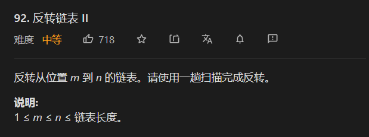

## 已解决题目列表


| 题目 | 名称     | 解法   | 难度   |
| ---- | -------- | ------ | ------ |
| 1    | 两数之和 | hash   | easy   |
| 15   | 三数之和 | 双指针 | middle |
|      |          |        |        |

## 2.两数相加

思路：

关键点： 

* 如果为空  就用0 占位

* 使用一个进位，每次都要加上上一次的进位。在最后一步的时候，还好需要判断进位是否为0  来加上最后一位。
* 链表的解法中 一般都需要在第一位加上一个“哨兵” 作为  头结点

```java
class Solution {
    public ListNode addTwoNumbers(ListNode l1, ListNode l2) {
        int jinwei = 0;
        ListNode cur = new ListNode(0);
        ListNode res =cur ; 
        while(l1!=null||l2!=null||jinwei!=0){
          int num1 = 0;
          int num2 = 0;
    
         num1 =  l1==null? 0 : l1.val;
         num2 = l2==null?0 : l2.val;
         int num =  num1 + num2 + jinwei;
         jinwei = num / 10;
         num = num % 10;
         ListNode newlist = new ListNode(num);
         cur.next = newlist;
         cur  =  cur.next;
         if(l1!=null)l1 = l1.next;
         if(l2!=null)l2 = l2.next;
        }
        return res.next;
    }
}
```

## 23 合并K个升序链表

[题解](https://leetcode-cn.com/problems/merge-k-sorted-lists/solution/he-bing-kge-pai-xu-lian-biao-by-leetcode-solutio-2/)

使用优先队列

```java
 public ListNode mergeKLists(ListNode[] lists) {
         if(lists==null||lists.length==0) return null;
        // if(lists[0]==null) return null;
        // System.out.print(lists[0]==null);
          ListNode head =  new ListNode(0);
          ListNode cur = head;
          PriorityQueue<ListNode> queue = new PriorityQueue<>((node1,node2)->(node1.val-node2.val));
          for(ListNode node  : lists){
            if(node==null) continue;
            queue.offer(node);
          }
          while(!queue.isEmpty()){
            ListNode node  = queue.poll();
            cur.next = node;
            cur = cur.next;
            node=node.next;
            if(node!=null){
              queue.offer(node);
            } 
          }
          return head.next;

    }
```

## 反转链表 II



两种解法 ：

官方题解和不错

[题解](https://leetcode-cn.com/problems/reverse-linked-list-ii/solution/fan-zhuan-lian-biao-ii-by-leetcode-solut-teyq/)

### 解法一  截取出来翻转

```java

/**
 * @Classname Q92
 * @Description:
 * @Date 2021/3/19 20:24
 * @Created by qiujunlin
 */

public class Solution {
    public  void reverse(ListNode node){
        //ListNode head  = null;
        ListNode cur = node;
        ListNode head = null;
        while (cur!=null){
           ListNode temp = cur.next;
           cur.next= head;
           head =cur;
           cur = temp;
        }
    }
    public ListNode reverseBetween(ListNode head, int left, int right) {
        ListNode sentry =  new ListNode();
        sentry.next =head;
        ListNode pre = null;
        ListNode first = null,last =null,reversefirst = null,reverselast =null;
        ListNode cur  = sentry;
        pre =sentry;
        //寻找左边节点
        for(int i= 0;i<left;i++){
           pre =cur;
            cur = cur.next;
           
        }
        first = pre;
        first.next = null;
        reversefirst = cur;

        for(int i = 0 ;i < right-left;i++){
            pre = cur;
            cur = cur.next;
           
        }
        last =  cur.next;
        reverselast = cur;
        reverselast.next = null;
        reverse(reversefirst);
        
        first.next  =  reverselast;
        reversefirst.next = last;
        return  sentry.next;
}
}
```


### 解法二  一次遍历翻转


```java
    public ListNode reverseBetween(ListNode head, int left, int right) {
        ListNode sentry =  new ListNode();
        sentry.next =  head;
        ListNode cur  = sentry;
        //寻找左边节点
        for(int i= 0;i<left-1;i++){
            cur = cur.next;  
        }
        ListNode  first = cur;
        cur =cur.next;
        for(int i = 0 ;i < right-left;i++) {
            ListNode temp = cur.next;
            cur.next=temp.next;
            temp.next = first.next;
            first.next=temp;
            //cur=cur.next;
        }
        return  sentry.next;
    }
```

