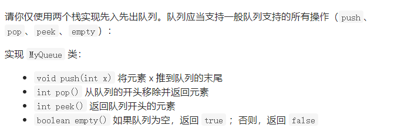

## 20 有效的括号

使用栈 

```java
 public boolean isValid(String s) {
        char ch[] = s.toCharArray();
       Stack<Character> stack = new Stack();
       for(char c: ch){
         if(stack.isEmpty()) stack.push(c);
         else if(c==']'&&stack.peek()=='['){
           stack.pop();
         }else if(c==')'&&stack.peek()=='('){
             stack.pop();
         }else if(c=='}'&&stack.peek()=='{'){
              stack.pop();
         }else {
           stack.push(c);
         }
       }
       return stack.size()==0;
    }
```

##  150-逆波兰表达式求值


这道题是栈的应用 思路就是简单的入栈出站

```java
class Solution {
    public int evalRPN(String[] tokens) {
        Stack<Integer> stack = new Stack<>();
        for(int i=0;i<tokens.length;i++){
            if(i<=1) stack.push(Integer.valueOf(tokens[i]));
            else{
                String s  = tokens[i];
                if(Character.isDigit(s.charAt(s.length()-1))){
                    stack.push(Integer.valueOf(s));
                }else if(s.equals("+")){
                    Integer num1 = stack.pop();
                    Integer num2 = stack.pop();
                    stack.push(num2+num1);
                }else  if(s.equals("-")){
                    Integer num1 = stack.pop();
                    Integer num2 = stack.pop();
                    stack.push(num2-num1);
                }else if(s.equals("/")){
                    Integer num1 = stack.pop();
                    Integer num2 = stack.pop();
                    stack.push(num2/num1);
                }else  if(s.equals("*")){
                    Integer num1 = stack.pop();
                    Integer num2 = stack.pop();
                    stack.push(num2*num1);
                }
            }
           // System.out.println(stack);
        }
            return  stack.peek();

    }
}
```

## 232 用栈实现队列



### 解法一

第一种是没吃加入都进行变换，使之有序。但是这个时间浮渣度为O N 这种解法不可取

```java
class MyQueue {

    /** Initialize your data structure here. */
    Stack<Integer> stack1 ;
    Stack<Integer> stack2;
    public MyQueue() {
       stack1 =  new Stack();
       stack2 = new Stack();
    }
    
    /** Push element x to the back of queue. */
    public void push(int x) {
        while(stack1.size()!=0){
            stack2.push(stack1.pop());
        }
        stack2.push(x);
        while(stack2.size()!=0){
            stack1.push(stack2.pop());
        }
    }
    
    /** Removes the element from in front of queue and returns that element. */
    public int pop() {
       return stack1.pop();
    }
    
    /** Get the front element. */
    public int peek() {
         return stack1.peek();
    }
    
    /** Returns whether the queue is empty. */
    public boolean empty() {
   return stack1.isEmpty();
    }
}

/**
 * Your MyQueue object will be instantiated and called as such:
 * MyQueue obj = new MyQueue();
 * obj.push(x);
 * int param_2 = obj.pop();
 * int param_3 = obj.peek();
 * boolean param_4 = obj.empty();
 */
```

### 解法二  ！！重点

均摊时间浮渣度有，就是在当输出的栈为空的时候 才将输栈中的数据转入到输出栈里面去

```java
class MyQueue {
    Stack<Integer> in;
    Stack<Integer> out ;
    /** Initialize your data structure here. */
    public MyQueue() {
        in = new Stack();
        out = new Stack();
    }
    
    /** Push element x to the back of queue. */
    public void push(int x) {
          in.push(x);
    }
    
    /** Removes the element from in front of queue and returns that element. */
    public int pop() {
       if(out.isEmpty()){
           while(!in.isEmpty()) out.push(in.pop());
       }
    return out.pop();
    }
    
    /** Get the front element. */
    public int peek() {
        if(out.isEmpty()){
           while(!in.isEmpty()) out.push(in.pop());
       }
        return out.peek();
    }
    
    /** Returns whether the queue is empty. */
    public boolean empty() {
      return  in.isEmpty()&&out.isEmpty();
    }
}

/**
 * Your MyQueue object will be instantiated and called as such:
 * MyQueue obj = new MyQueue();
 * obj.push(x);
 * int param_2 = obj.pop();
 * int param_3 = obj.peek();
 * boolean param_4 = obj.empty();
 */
```

