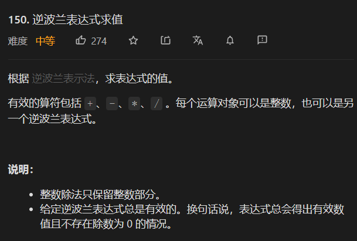

## 20 有效的括号

使用栈 

```java
 public boolean isValid(String s) {
        char ch[] = s.toCharArray();
       Stack<Character> stack = new Stack();
       for(char c: ch){
         if(stack.isEmpty()) stack.push(c);
         else if(c==']'&&stack.peek()=='['){
           stack.pop();
         }else if(c==')'&&stack.peek()=='('){
             stack.pop();
         }else if(c=='}'&&stack.peek()=='{'){
              stack.pop();
         }else {
           stack.push(c);
         }
       }
       return stack.size()==0;
    }
```

##  150-逆波兰表达式求值




这道题是栈的应用 思路就是简单的入栈出站

```java
class Solution {
    public int evalRPN(String[] tokens) {
        Stack<Integer> stack = new Stack<>();
        for(int i=0;i<tokens.length;i++){
            if(i<=1) stack.push(Integer.valueOf(tokens[i]));
            else{
                String s  = tokens[i];
                if(Character.isDigit(s.charAt(s.length()-1))){
                    stack.push(Integer.valueOf(s));
                }else if(s.equals("+")){
                    Integer num1 = stack.pop();
                    Integer num2 = stack.pop();
                    stack.push(num2+num1);
                }else  if(s.equals("-")){
                    Integer num1 = stack.pop();
                    Integer num2 = stack.pop();
                    stack.push(num2-num1);
                }else if(s.equals("/")){
                    Integer num1 = stack.pop();
                    Integer num2 = stack.pop();
                    stack.push(num2/num1);
                }else  if(s.equals("*")){
                    Integer num1 = stack.pop();
                    Integer num2 = stack.pop();
                    stack.push(num2*num1);
                }
            }
           // System.out.println(stack);
        }
            return  stack.peek();

    }
}
```

