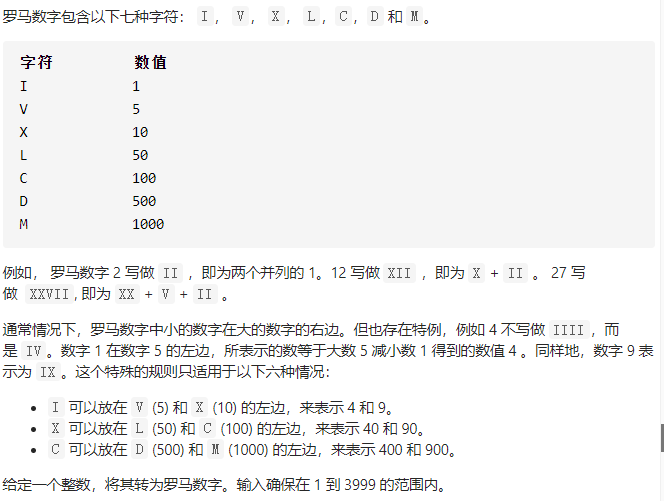

## 已解决题目列表


| 题目 | 名称     | 解法   | 难度   |
| ---- | -------- | ------ | ------ |
| 1    | 两数之和 | hash   | easy   |
| 15   | 三数之和 | 双指针 | middle |
|      |          |        |        |

## 8.字符串转整数

真恶心的一道题，wa了好多次。题意也太奇葩了。


```Java
class Solution {
    public int myAtoi(String s) {
      int i=0;
      int len = s.length();
      char ch[] = s.toCharArray();
      //去除前面空格
      while(i<len&&ch[i]==' ') i++;
      if(i==len) return 0;
      //判断正负
      int flag =1;
      if(ch[i]=='-') {
        flag=-1;
        i++;
      }
      else if(ch[i]=='+') i++;
      //去除0
      if(i==len||ch[i]<'0'||ch[i]>'9'){
        return 0;
      }
      while(i<len&&ch[i]=='0'){
          i++;
      }
      if(i==len) return 0;
      long res = 0;
       while(i<ch.length&&ch[i]>='0'&&ch[i]<='9'){
            int temp = ch[i]-'0';
            long newres = (res*10+temp);
            if((flag==1&&newres>Integer.MAX_VALUE)||(flag==-1&&newres*flag<Integer.MIN_VALUE)){
              return flag==1?Integer.MAX_VALUE:Integer.MIN_VALUE;
            }
            res = newres;
            i++;
       }
          return (int)res*flag;
    }
}
```

## 12 整数转罗马数字




使用技巧

```
 public String intToRoman(int num) {
        // 把阿拉伯数字与罗马数字可能出现的所有情况和对应关系，放在两个数组中，并且按照阿拉伯数字的大小降序排列
        int[] nums = {1000, 900, 500, 400, 100, 90, 50, 40, 10, 9, 5, 4, 1};
        String[] romans = {"M", "CM", "D", "CD", "C", "XC", "L", "XL", "X", "IX", "V", "IV", "I"};

        StringBuilder stringBuilder = new StringBuilder();
        int index = 0;
        while (index < 13) {
            // 特别注意：这里是等号
            while (num >= nums[index]) {
                stringBuilder.append(romans[index]);
                num -= nums[index];
            }
            index++;
        }
        return stringBuilder.toString();
    }
```

