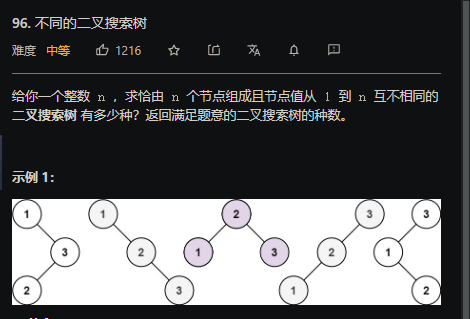

## 已解决题目列表


| 题目 | 名称     | 解法   | 难度   |
| ---- | -------- | ------ | ------ |
| 1    | 两数之和 | hash   | easy   |
| 15   | 三数之和 | 双指针 | middle |
|      |          |        |        |

##  二叉树前序遍历

##  二叉树中序遍历

##  二叉树后序遍历

##  二叉树层序遍历

## 103  二叉树锯齿遍历

套模板，增加一个值判断层数是否需要倒过来遍历。利用LinkedList 的 addFirst和addLast方法

这道题递归也可以做。

```java
public List<List<Integer>> zigzagLevelOrder(TreeNode root) {
     List<List<Integer>>  res = new LinkedList();
    if(root==null) return res;
     Queue<TreeNode> queue  = new LinkedList();
     queue.offer(root);
     boolean flag=true;
     while(queue.size()!=0){
         int  len=queue.size();
         LinkedList<Integer> list = new LinkedList();
         while(len!=0){
             TreeNode node = queue.poll();
             if(flag) list.addLast(node.val);
             else  list.addFirst(node.val);
             if(node.left!=null) queue.offer(node.left);
             if(node.right!=null) queue.offer(node.right);
             len--;
         }
         res.add(list);
         flag=!flag;
     
    }
    return res;
    }
```


## 95不同的二叉树搜索树ii

## 96不同的二叉搜索树



使用动态规划


## 98  验证二叉搜索树

## 99  恢复二叉搜索树


## 100  相同的树

## 101  对称二叉树

## 104  二叉树的最大深度

## 105  前序遍历与中序遍历构造二叉树

## 106  中序遍历与后序遍历构造二叉树

## 108  将有序数组转化为二叉搜索树

## 110  平衡二叉树

## 111  二叉树的最小深度

## 112  路径总和

## 113  路径总和2

## 114  二叉树展开为链表

## 116  填充每个节点的下一个右侧节点指针

## 117  填充每个节点的下一个右侧节点指针2

## 124  二叉树中的最大路径和

## 173  二叉搜索树迭代器

## 199  二叉树右视图

## 222  完全二叉树的节点个数

两种解法，第一种解法，就是通过遍历来统计个数，很容易想到的方法。

这道题只需要了解完全二叉树的一些性质：完全二叉树除最后一层之外其他的层都是满的，最后一层如果不满的话，所有的节点都靠左，紧密靠左。

**思路：**

果满二叉树的层数为h，则总节点数为：2^h - 1.对 root 节点的左右子树进行高度统计，分别记为 left 和 right，有以下两种结果：

* left == right。这说明，左子树一定是满二叉树，因为节点已经填充到右子树了，左子树必定已经填满了。所以左子树的节点总数我们可以直接得到，是 2^left - 1，加上当前这个 root 节点，则正好是 2^left。再对右子树进行递归统计。
* left != right。说明此时最后一层不满，但倒数第二层已经满了，可以直接得到右子树的节点个数。同理，右子树节点 +root 节点，总数为 2^right。再对左子树进行递归查找。

```java
 public int countNodes(TreeNode root) {
      if(root==null) return 0;
      int left=depth(root.left);
      int right=depth(root.right);
      if(left==right) return  (int)Math.pow(2,left)+countNodes(root.right);
       else return (int)Math.pow(2,right)+countNodes(root.left);
    }
    public int depth(TreeNode root){
        if(root==null) return 0;
        return depth(root.left)+1;
    }
```


## 230  二叉树中第K小的元素

## 235  二叉树的最近公共祖先

## 450  在二叉搜索树种删节点

## 508  出现次数最多的子树元素和

## 513  找树左下角的值

## 865  具有所有最深节点的最小子树)

## 998  最大二叉树II

## 1022  从根到叶的二进制数之和