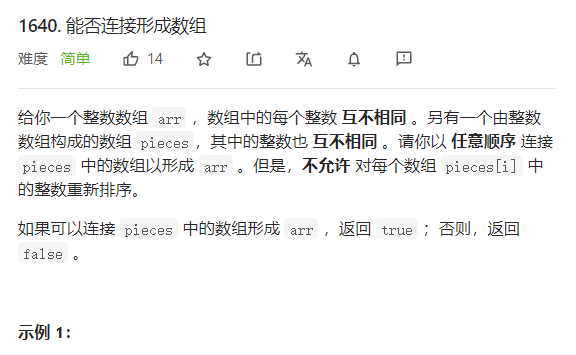
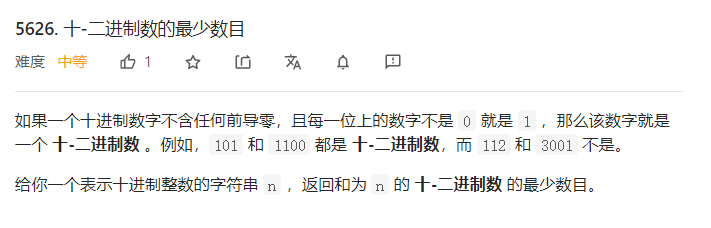

## 已解决题目列表

| 周赛 | 题目编号 | 题名                       | 难度   | 题解 |
| ---- | -------- | -------------------------- | ------ | ---- |
| 213  | 1640     | 能否连接形成数组           | easy   |      |
| 214  | 1646     | 获取生成数组中的最大值     | easy   |      |
| 241  | 1647     | 字符频次唯一的最小删除次数 | middle |      |
| 215  | 5601     | 设计有序流                 | easy   |      |
| 215  | 5603     | 确定两个字符串是否接近     | middle |      |

## week 213

### 1640. 能否连接形成数组



```java
public boolean canFormArray(int[] arr, int[][] pieces) {
        for(int j=0;j<pieces.length;j++){
            int index=0;
            int len=pieces[j].length;
            int flag=0;
            for(int k=0;k<arr.length;k++){
                if(flag==1&&arr[k]!=pieces[j][index]) return false;
                if(arr[k]==pieces[j][index]){
                    index++;
                    flag=1;
                    if(index==len)  break;
                }

            }
            if(index!=len) return false;
        }
        return true;
    }
```

## week214

### 1646. 获取生成数组中的最大值

```java
 public int getMaximumGenerated(int n) {
      if(n==0) return 0;
      int a[]= new int[n+1];
      a[0]=0;
      a[1]=1;
      for(int i=1;i<=n;i++){
         if(i*2>=2&&i*2<=n)  a[i*2]=a[i];
         if((i*2+1)>=2&&(i*2+1)<=n){
          a[2*i + 1] = a[i] + a[i + 1];
        }
      }
    int max=0;
    for(int i=0;i<a.length;i++){
      if(a[i]>max){
        max=a[i];
      }
    }
       return max;
    }
```

### 1647. 字符频次唯一的最小删除次数


解法一  ：最初的解法，这个解法太辣鸡了，代码简直辣眼睛

```java
 //第一次 百分之五六十
    public int minDeletions(String s) {
        Map<Character, Integer> map = new HashMap<>();
        for (int i = 0; i < s.length(); i++) {
            map.put(s.charAt(i), map.getOrDefault(s.charAt(i), 0) + 1);
        }
        List<Map.Entry<Character, Integer>> list = new LinkedList<>(map.entrySet());
        Collections.sort(list, new Comparator<Map.Entry<Character, Integer>>() {
            @Override
            public int compare(Map.Entry<Character, Integer> e1, Map.Entry<Character, Integer> e2) {
                return (e1.getValue()).compareTo(e2.getValue());
            }
        });
        Map<Character, Integer> result = new LinkedHashMap<>();
        for (Map.Entry<Character, Integer> entry : list) {
            result.put(entry.getKey(), entry.getValue());
        }
        int times=0;
        System.out.println(map);
        for (Character a:
                result.keySet()) {
            Integer re=map.get(a);
            map.put(a,map.get(a)+1);
            while(map.containsValue(re)){
                System.out.println(re);
                int newval= re-1;
                re=newval;
                times++;
                if(newval==0) break;

            }
            map.put(a,re);
        }
        return times;
    }
```

解法二

```java
 //第二次 双百
    public int minDeletions2(String s) {
        int  a[]= new int[26];
        for(int i=0;i<s.length();i++){
            a[s.charAt(i)-'a']++;
        }
        Arrays.sort(a);
        Set<Integer> set= new HashSet();
        int times=0;
        for(int i=0;i<a.length;i++){
            int k=0;
            while(a[i]!=0&&set.add(a[i])==false){
                k++;
                a[i]--;
            }
            times+=k;
        }
        return times;
    }
```

## week215

### 1656. 设计有序流

难在看题

```java 

    String a[];
    int ptr=0;
    public OrderedStream(int n) {
      a=new String[n];
    } 
    public List<String> insert(int id, String value) {
         List<String> list  = new ArrayList<>();
         a[id-1]=value;
         while(ptr<a.length&&a[ptr]!= null){
           list.add(a[ptr++]);
         }
        return list;
    }
```

### 1657. 确定两个字符串是否接近


这一道题思路

只要满足两个条件就可以：

第一个，word1中出现的字符在word2中都出现。

第二个，字符出现的频次数相等。比如，对于word1中字符出现次数从小到大排序为531，那么word2中字符出现的次数从小到大也必须是531。无需出现的次数对应的字符相同。


```java
public boolean closeStrings(String word1, String word2) {
            int a[]=new int[26];
          int b[]=new int[26];
      
          for(int i=0;i<word1.length();i++){
            a[word1.charAt(i)-'a']++;
          }
          for(int i=0;i<word2.length();i++){
            b[word2.charAt(i)-'a']++;
          }
          for(int i=0;i<26;i++){
            if((a[i]==0&&b[i]!=0) ||(a[i]!=0&&b[i]==0) )return false;
               
          }
          Arrays.sort(a);
          Arrays.sort(b);
               int index=25;
               while(index>=0){
                 if(a[index]!=b[index]) return false; 
                 index--;
               }
               
         return true;
    }

```


## week218

### 5617. 设计 Goal 解析器

```java
   public String interpret(String command) {
      String res="";
      
      for(int i=0;i<command.length();i++){
        char c=command.charAt(i);
        if(c=='G'){
          res+=c;
        }else {
           if(command.charAt(i+1)==')'){
             res=res+"o";
             i=i+1;
           }else{
             res=res+"al";
             i=i+3;
           }
        }
      }
      return res;
    }
```

### 5618. K 和数对的最大数目

排序+双指针

```
public int maxOperations(int[] nums, int k) {
       Arrays.sort(nums);
      int times=0;
      for(int i=0,j=nums.length-1;i<j&&i<nums.length&&j>0;){
           if(nums[i]+nums[j]==k){
              times++;
               i++;j--;
           }else if(nums[i]+nums[j]<k){
               i++;
           }else{
             j--;
           }
      }
          return times;
 
    }
```


### 5620. 连接连续二进制数字

没做出来，超时，两个方法都是参考大神的

#### 方法一

```java
public int concatenatedBinary(int n) {
         int nums[]=new int[20];
         nums[0]=1;
         for(int i=1;i<20;i++){
          nums[i]=nums[i-1]*2;
      }
        int mod=1000000007;
        long res=0;
        int len=1;
        int next=2;
        for(int i=1;i<=n;i++){
          if(i==next){
            len++;
            next=next*2;
          }
          res=(res*nums[len])%mod;
          res=(res+i)%mod;
        }
        return (int)res;
    }
```

#### 解法二

解法二 太厉害了  ，实在是太厉害了，[解析在这](https://leetcode-cn.com/problems/concatenation-of-consecutive-binary-numbers/solution/lian-jie-lian-xu-er-jin-zhi-shu-zi-by-ze-t40j/)

```java
public int concatenatedBinary(int n) {
        int mod=1000000007;
        long res=0;
        int len=0;
        for(int i=1;i<=n;i++){
          if(((i&(i-1)))==0){   //
            len++;
          }
          res=((res<<len)%mod+i)%mod;
        //  res=(res+i)%mod;
        }
        return (int)res;
    }
}
```

## week219

## 5625. 比赛中的配对次数

贪心吧 ，模拟就行了

```java
 public int numberOfMatches(int n) {
              int res=0;
              while(n>1){
                  res+=n/2;
                  n=n/2+n%2;
              }
              return res;
    }
```


## 5626. 十-二进制数的最少数目

脑筋急转弯？？



这道题想了一下 无从下手 ，最后发现是技巧题 ，只需要求最大的数字就可以了

```java
 public int minPartitions(String n) {
                 int max=0;
                 for(int i=0;i<n.length();i++){
                      if(n.charAt(i)-'0'>max) max=n.charAt(i)-'0';
                 }
                 return max;
    }
```

## 5627. 石子游戏 VII