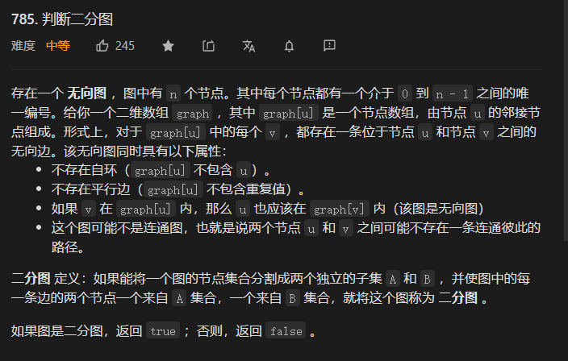
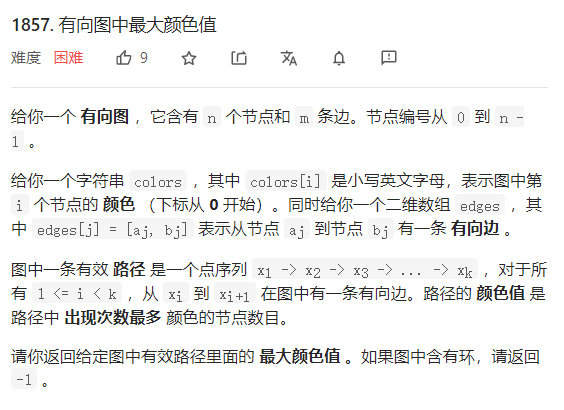

## 785判断二分图



有bfs和dfs两种解法 ,参考官方题解或者算法4

### 解法一 dfs

```java
class Solution {
  public boolean isBipartite(int[][] graph) {
       //创建邻接链表
        int len = graph.length;
        boolean vis[] = new boolean[len];
        boolean color[] = new boolean[len];
        for(int i=0;i<len;i++){
            if(!vis[i]){
               boolean res =  dfs(graph,color,vis,i);
               if(!res) return  false;
            }
        }
        return  true;
    }
    boolean dfs(int graph[][], boolean color[],boolean vis[],int s){
         vis[s] = true;
         for(int a : graph[s]){
             if(!vis[a]){
             color[a] = !color[s];
            boolean flag = dfs(graph,color,vis,a);
            if(!flag) return flag;
             }else{
                 if(color[a]==color[s])  return  false;
             }
         }
         return  true;
    }
}
//创建 
```

### 解法二 BFS

```JAVA
 boolean bfs(int graph[][], boolean color[], boolean vis[], int s) {
        Queue<Integer> queue = new LinkedList<>();
        queue.add(s);
        vis[s] =true;
        while (!queue.isEmpty()) {
            int a = queue.poll();
            for (int c : graph[a]) {
                if (!vis[c]) {
                    color[c] = !color[a];
                    queue.offer(c);
                    vis[c] =true;
                }
                else{
                    if (color[a] == color[c]) return false;
                }
            }
        }
        return  true;
        }
```


## 1743 从相邻元素还原数组

## 解法一 领接表

这道题的思路 

* 用领接表表示每一个节点的所有相邻的节点
* 遍历邻接表，找出与之相邻的节点只有一个的节点，这个节点就是起点
* 遍历领接表，组合数组

```java
    public int[] restoreArray(int[][] adjacentPairs) {
        HashMap<Integer, LinkedList<Integer>> map = new HashMap();
        for (int a[] : adjacentPairs) {
            map.put(a[0], map.getOrDefault(a[0], new LinkedList()));
            map.get(a[0]).offer(a[1]);
            map.put(a[1], map.getOrDefault(a[1], new LinkedList()));
            map.get(a[1]).offer(a[0]);
        }
        int start = 0;
        for (int a : map.keySet()) {
            if (map.get(a).size() == 1) start = a;
        }
        int res[] = new int[adjacentPairs.length + 1];
        int pre = start;
        res[0] = start;
        for (int i = 1; i < res.length; i++) {
            LinkedList<Integer> list = map.get(pre);
            System.out.print(list);
            if (i == 1) {
                res[i] = list.get(0);
                pre = res[i];
                continue;
            }
            for (int a : list) {
                if (res[i - 2] != a) {
                    res[i] = a;
                    pre = a;
                    break;
                }
            }

        }
        return res;
    }
```

## 1857  有向图中的最大颜色值



**解法  拓扑排序 加动态规划**

```java
class Solution {
    public int largestPathValue(String colors, int[][] edges) {
      
     HashMap<Integer,List<Integer>> map =new HashMap<>();
     HashMap<Integer,Character> color =new HashMap<>();
     int in[] = new int[colors.length()];
     for(int a[] :  edges){
         List<Integer> list = map.computeIfAbsent(a[0],(k)->new ArrayList<Integer>());
         map.computeIfAbsent(a[1],(k)->new ArrayList<Integer>());
         in[a[1]]++;
         list.add(a[1]);
     }
     int len = colors.length();
     Queue<Integer> queue = new LinkedList<>();
     for(int i=0;i<len;i++){
         if(in[i]==0){
             queue.offer(i);
         }
           map.computeIfAbsent(i,(k)->new ArrayList<Integer>());
     }
     for(int i=0;i<len;i++) color.put(i,colors.charAt(i));
     int dp[][] = new int[len][26];
     int count =0;
     while (!queue.isEmpty()){
         count++;
         Integer id = queue.poll();
         char cc = color.get(id);
         dp[id][cc-'a']++;
         for(int a:map.get(id)){
             char c = color.get(a);
             for(int i=0;i<26;i++){
                 dp[a][i] = Math.max(dp[id][i],dp[a][i]);
                 
              }
              in[a]--;
              if(in[a]==0) queue.offer(a);
         }
     }
     if(count<len) return  -1;

     int max  = 0 ;
     for(int i=0;i<len;i++){
         for(int j=0;j<26;j++){
             max = Math.max(dp[i][j],max);
         }
     }
     return  max;
    }
}
```

