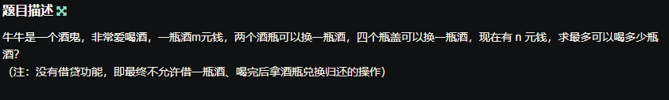
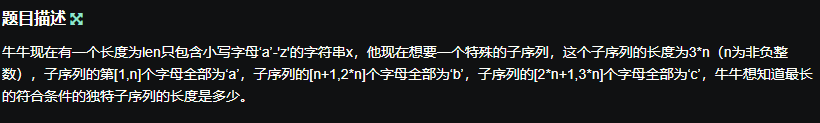
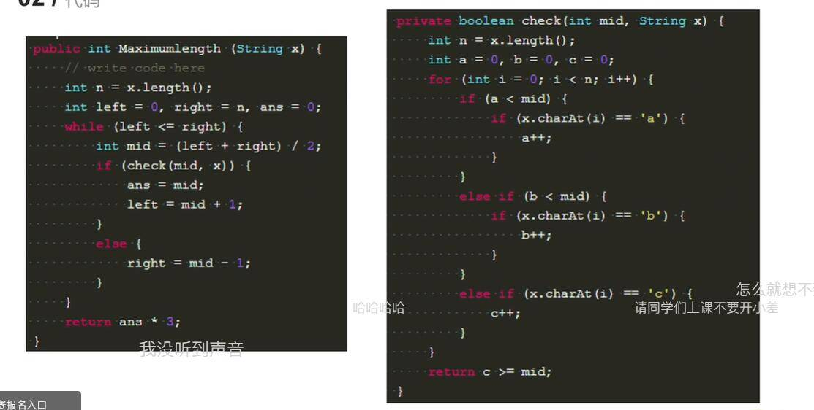

## 牛客编程巅峰赛S2第7场

###  牛牛爱喝酒 



```java 
 /**
     * 代码中的类名、方法名、参数名已经指定，请勿修改，直接返回方法规定的值即可
     * 返回牛牛能喝的最多的酒
     * @param m int整型 酒单价
     * @param n int整型 牛牛的现金
     * @return int整型
     */
    public int countWine (int m, int n) {
        // write code here
         // write code here
        int res=0;
        n=n/m;
        int a=n;//瓶
        int b=n;//瓶盖
        while(a>=2||b>=4){
            res=res+n;
            n=a/2+b/4;
            a=a%2+n;
            b=b%4+n;
        }
        return res+n;
    }
```

###  牛牛的独特子序列 



```
二分查找 ！！！！！
子序列 没有说连续 ！！！这是重点！！！！

```

